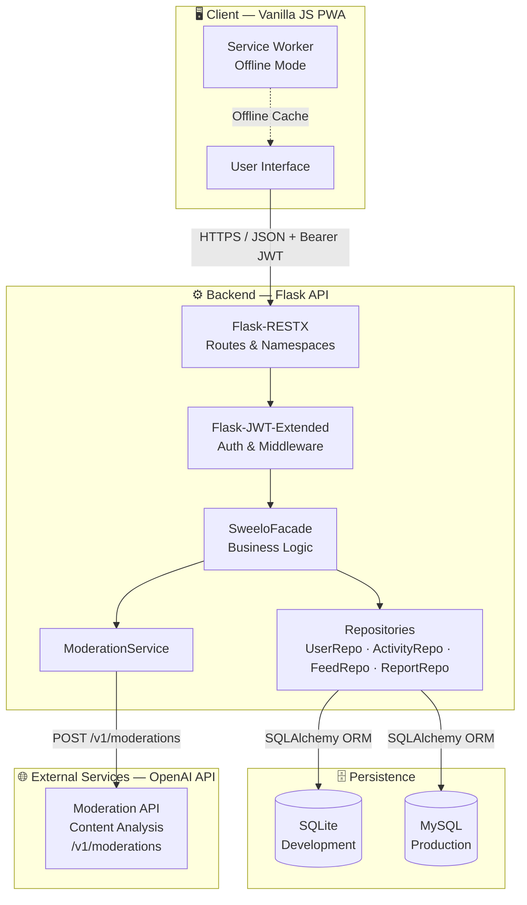
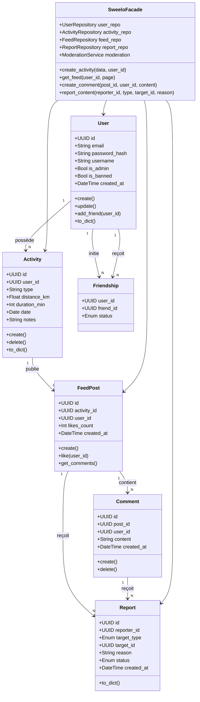
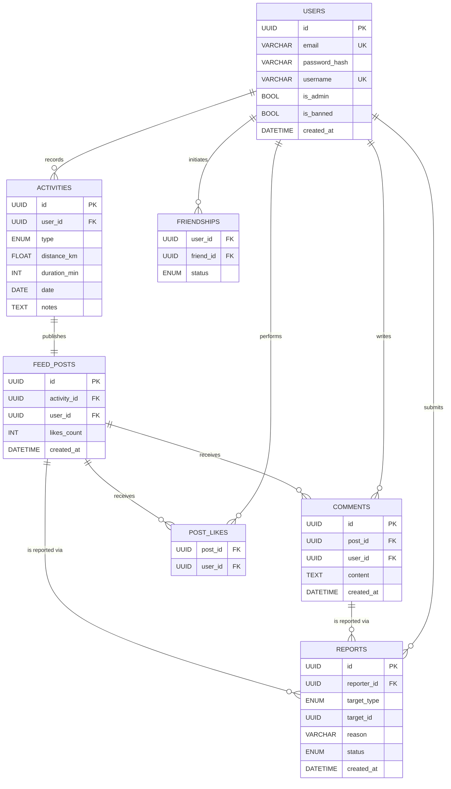
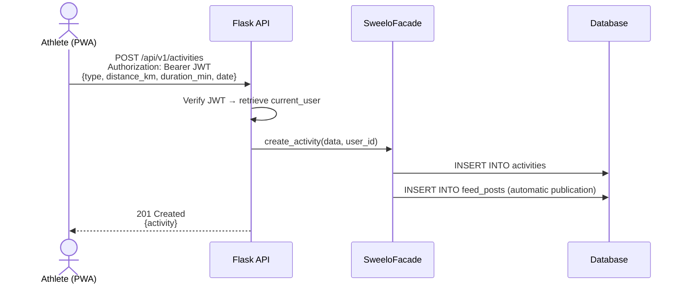
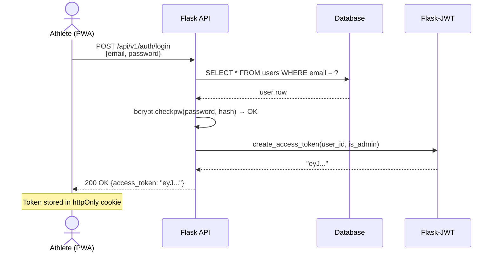
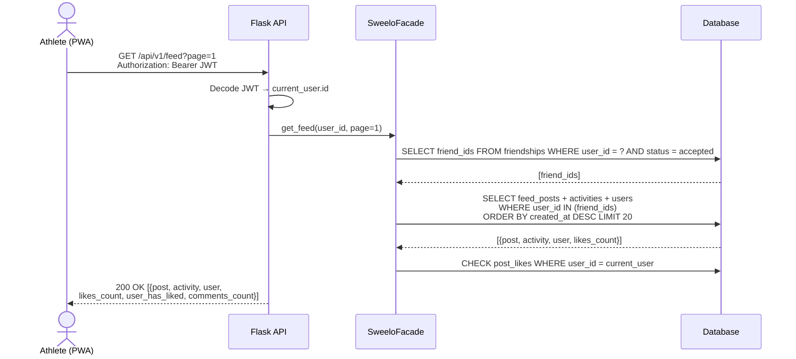
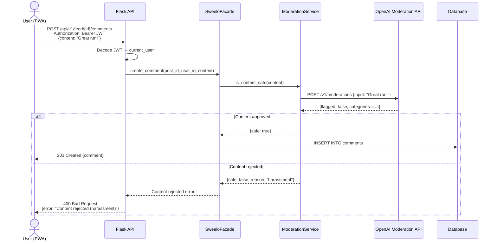
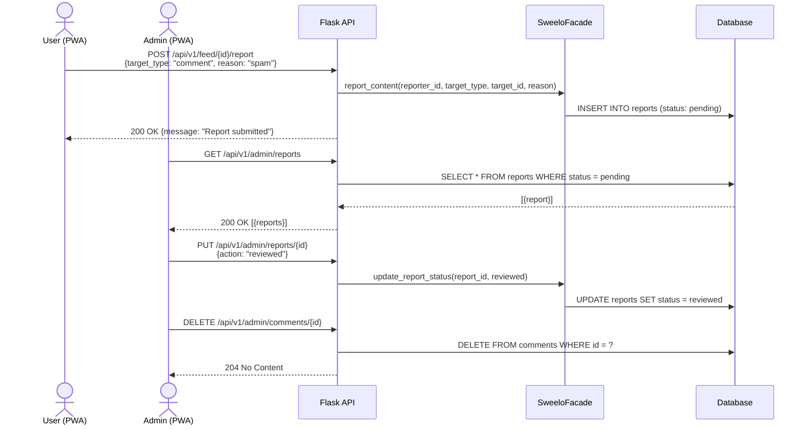
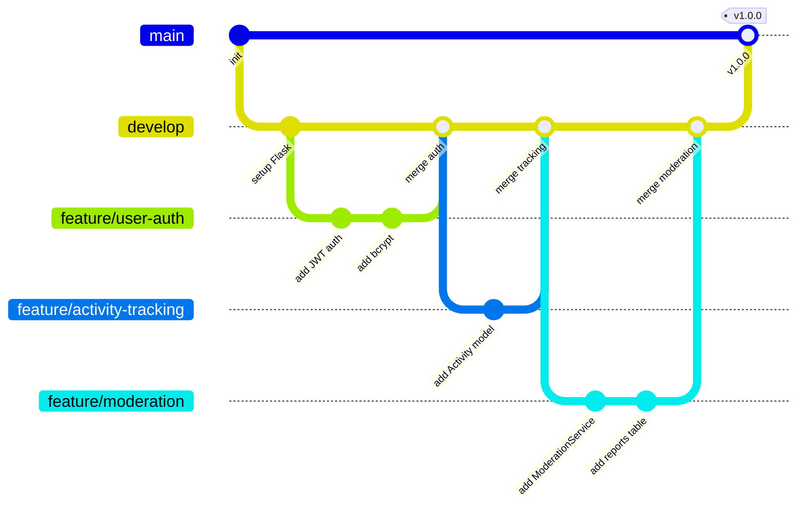

# Sweelo — Stage 3: Technical Documentation

> Sports tracking and sports social network application for amateur athletes

> **Stack:** Flask · SQLAlchemy · JWT · Vanilla JS PWA

> **Team:** Arthur Moulard · Valentin Pasquiet

> **Database:** SQLite (dev) → MySQL (prod)

---

# Table of Contents

1. [User Stories & Mockups](#1-user-stories--mockups)
2. [System Architecture](#2-system-architecture)
3. [Components, Classes & Database](#3-components-classes--database)
4. [Sequence Diagrams](#4-sequence-diagrams)
5. [API Specifications](#5-api-specifications)
6. [Content Moderation](#6-content-moderation)
7. [SCM & QA](#7-scm--qa)
8. [Technical Justifications](#8-technical-justifications)

---

# 1. User Stories & Mockups

## Prioritization Method: MoSCoW

### Must Have — Core MVP

| #     | User Story                                                                                                                                        | Priority |
| ----- | ------------------------------------------------------------------------------------------------------------------------------------------------- | -------- |
| US-01 | As an athlete, I want to create an account with an email/password so that I can access my personalized data.                                      | 🔴 Must  |
| US-02 | As an athlete, I want to log in and obtain a JWT token so that I can access protected routes.                                                     | 🔴 Must  |
| US-03 | As an athlete, I want to record an activity (type, distance, duration, date) so that I can track my workouts.                                     | 🔴 Must  |
| US-04 | As an athlete, I want to view my activity history so that I can monitor my progress.                                                              | 🔴 Must  |
| US-05 | As an athlete, I want to see a social feed of my friends’ activities so that I can stay motivated.                                                | 🔴 Must  |
| US-06 | As an admin, I want to ban or delete a user so that I can keep the community healthy.                                                             | 🔴 Must  |
| US-07 | As a user, I want to report a post or comment so that I can alert moderators about inappropriate content.                                         | 🔴 Must  |
| US-08 | As a system, I want to submit every post or comment to the OpenAI Moderation API before insertion so that toxic content is automatically blocked. | 🔴 Must  |

### Should Have — Important Added Value

| #     | User Story                                                                                             | Priority  |
| ----- | ------------------------------------------------------------------------------------------------------ | --------- |
| US-09 | As an athlete, I want to add friends via their username so that I can follow their activities.         | 🟠 Should |
| US-10 | As an athlete, I want to like or comment on a feed activity so that I can interact with my friends.    | 🟠 Should |
| US-11 | As an admin, I want to review and process reports so that I can manually moderate the platform.        | 🟠 Should |
| US-12 | As an admin, I want to delete a reported post or comment so that I can moderate inappropriate content. | 🟠 Should |

### Could Have / Won’t Have

| #     | User Story                                                                                    | Priority      |
| ----- | --------------------------------------------------------------------------------------------- | ------------- |
| US-13 | As an athlete, I want to track my activity in real time via GPS from my smartphone.           | 🟡 Could      |
| US-14 | As an athlete, I want to connect my smartwatch via Bluetooth to automatically import my data. | ⚪ Won’t (MVP) |
| US-15 | As an athlete, I want to share my activity on Instagram or Twitter.                           | ⚪ Won’t (MVP) |

## Mockups — Main Screens

The interactive mockups below cover all MVP screens, organized by role (user and admin). Each screen is accessible via the sidebar menu and corresponds to the associated user stories.

| Screen                 | Expected Content                                      | Covered User Stories |
| ---------------------- | ----------------------------------------------------- | -------------------- |
| **Sign Up**            | Account creation form                                 | US-01                |
| **Login**              | Login form + JWT token response                       | US-02                |
| **Activity Log**       | Activity type, distance, duration, date, notes        | US-03                |
| **History**            | Monthly stats, weekly chart, filterable activity list | US-04                |
| **Social Feed**        | Friends’ activities, likes, comments, report button   | US-05, US-07, US-10  |
| **Admin — Users**      | Global stats, user list, ban/warn actions             | US-06                |
| **Admin — Moderation** | Reports queue, OpenAI score, block/approve actions    | US-08, US-11, US-12  |

## Sign Up


## Login


## Log an Activity


## History


## Feed


## Moderation


---

# 2. System Architecture

## High-Level Architecture Diagram



## Technical Stack

| Layer      | Technology            | Role                                                  |
| ---------- | --------------------- | ----------------------------------------------------- |
| Frontend   | Vanilla JS PWA        | User interface, Service Worker, Fetch API             |
| Backend    | Flask + Flask-RESTX   | REST API, namespaces, automatic Swagger documentation |
| Auth       | Flask-JWT-Extended    | Stateless JWT tokens, role-based access control       |
| ORM        | SQLAlchemy            | Database abstraction, Repository Pattern              |
| Dev DB     | SQLite                | Zero configuration, portable                          |
| Prod DB    | MySQL                 | Robustness, concurrency management                    |
| Moderation | OpenAI Moderation API | Automatic content analysis before publication         |
| Hashing    | bcrypt                | Secure password storage (OWASP)                       |

---

# 3. Components, Classes & Database

## Class Diagram



## Entity-Relationship Diagram (ER)



## Detailed Database Schema

| Table         | Main Columns                                                                                                                  | Relationships                                          |
| ------------- | ----------------------------------------------------------------------------------------------------------------------------- | ------------------------------------------------------ |
| `users`       | id PK, email UNIQUE, password_hash, username UNIQUE, is_admin, is_banned, created_at                                          | → activities (1-N), ↔ users (friends)                  |
| `activities`  | id PK, user_id FK, type ENUM(run/bike/swim/walk), distance_km, duration_min, date, notes                                      | ← users, → feed_posts (1-1)                            |
| `feed_posts`  | id PK, activity_id FK UNIQUE, user_id FK, likes_count, created_at                                                             | ← activities, → comments (1-N), ↔ users via post_likes |
| `comments`    | id PK, post_id FK, user_id FK, content, created_at                                                                            | ← feed_posts, ← users                                  |
| `post_likes`  | post_id FK, user_id FK — composite PK                                                                                         | N-N join table                                         |
| `friendships` | user_id FK, friend_id FK — composite PK, status ENUM(pending/accepted)                                                        | Self-referencing N-N table                             |
| `reports`     | id PK, reporter_id FK, target_type ENUM(comment/post), target_id, reason, status ENUM(pending/reviewed/dismissed), created_at | ← users, ← comments or feed_posts                      |

---

# 4. Sequence Diagrams

## Flow 1 — Activity Logging



## Flow 2 — Authentication & JWT



## Flow 3 — Social Feed Retrieval



## Flow 4 — Comment Submission with Automatic Moderation



## Flow 5 — Reporting & Admin Processing



---

# 5. API Specifications

## External APIs Used

| Service                   | Endpoint               | Usage                                         | Cost     |
| ------------------------- | ---------------------- | --------------------------------------------- | -------- |
| **OpenAI Moderation API** | `POST /v1/moderations` | Automatic content analysis before publication | **Free** |

## Authentication Endpoints

| Method | Route                   | Auth | Body                          | Response                    |
| ------ | ----------------------- | ---- | ----------------------------- | --------------------------- |
| `POST` | `/api/v1/auth/register` | —    | `{email, password, username}` | `201 {id, email, username}` |
| `POST` | `/api/v1/auth/login`    | —    | `{email, password}`           | `200 {access_token}`        |

## Activity Endpoints

| Method   | Route                    | Auth        | Body / Params                                    | Response                 |
| -------- | ------------------------ | ----------- | ------------------------------------------------ | ------------------------ |
| `GET`    | `/api/v1/activities`     | JWT         | `?page=1&limit=20`                               | `200 [{activity}]`       |
| `POST`   | `/api/v1/activities`     | JWT         | `{type, distance_km, duration_min, date, notes}` | `201 {activity}`         |
| `GET`    | `/api/v1/activities/:id` | JWT         | —                                                | `200 {activity}` / `404` |
| `DELETE` | `/api/v1/activities/:id` | JWT + owner | —                                                | `204` / `403`            |

## Feed & Social Endpoints

| Method | Route                       | Auth | Body / Params             | Response                                                                    |
| ------ | --------------------------- | ---- | ------------------------- | --------------------------------------------------------------------------- |
| `GET`  | `/api/v1/feed`              | JWT  | `?page=1`                 | `200 [{post, activity, user, likes_count, user_has_liked, comments_count}]` |
| `POST` | `/api/v1/feed/:id/like`     | JWT  | —                         | `200 {likes_count, liked: true}`                                            |
| `POST` | `/api/v1/feed/:id/comments` | JWT  | `{content}`               | `201 {comment}` / `400 if moderation fails`                                 |
| `POST` | `/api/v1/feed/:id/report`   | JWT  | `{target_type, reason}`   | `200 {message}`                                                             |
| `POST` | `/api/v1/users/:id/friend`  | JWT  | —                         | `200 {status: pending}`                                                     |
| `PUT`  | `/api/v1/users/:id/friend`  | JWT  | `{action: accept/reject}` | `200 {status: accepted}`                                                    |

## Profile & Statistics Endpoints

| Method | Route                    | Auth | Response                                      |
| ------ | ------------------------ | ---- | --------------------------------------------- |
| `GET`  | `/api/v1/users/me`       | JWT  | `200 {user, activities_count, friends_count}` |
| `PUT`  | `/api/v1/users/me`       | JWT  | `200 {updated user}`                          |
| `GET`  | `/api/v1/users/me/stats` | JWT  | `200 {total_km, total_min, weekly_summary}`   |

## Administration & Moderation Endpoints

| Method   | Route                         | Auth        | Body                           | Response         |
| -------- | ----------------------------- | ----------- | ------------------------------ | ---------------- |
| `GET`    | `/api/v1/admin/reports`       | JWT + Admin | —                              | `200 [{report}]` |
| `PUT`    | `/api/v1/admin/reports/:id`   | JWT + Admin | `{action: reviewed/dismissed}` | `200 {report}`   |
| `DELETE` | `/api/v1/admin/comments/:id`  | JWT + Admin | —                              | `204`            |
| `POST`   | `/api/v1/admin/users/:id/ban` | JWT + Admin | —                              | `200 {message}`  |

## Standard Response Format

```json
// Success
{
  "status": "success",
  "data": { "...": "..." }
}

// Error
{
  "status": "error",
  "message": "Error description",
  "code": 401
}
```

---

# 6. Content Moderation

## Strategy — 3 Complementary Levels

| Level          | Mechanism                    | Trigger                                      |
| -------------- | ---------------------------- | -------------------------------------------- |
| **Preventive** | OpenAI Moderation API (free) | Before every comment or activity note INSERT |
| **Reactive**   | User report system           | “Report” button on posts or comments         |
| **Manual**     | Admin routes (`is_admin`)    | Processing the reports queue                 |

## What the OpenAI Moderation API Detects

| Category     | Description                      |
| ------------ | -------------------------------- |
| `hate`       | Hate speech based on identity    |
| `harassment` | Harassment or intimidation       |
| `violence`   | Violent or threatening content   |
| `sexual`     | Sexually explicit content        |
| `self-harm`  | Self-harm related content        |
| `spam`       | Repetitive or irrelevant content |

## Behavior When Content Is Rejected

* The comment or activity note is **not inserted into the database**
* The API returns a `400 Bad Request` with the detected category
* If the OpenAI API fails: the content is allowed through (**fail open**) to avoid blocking the user experience

## Database Table — `reports`

| Column        | Type         | Constraint                           | Description             |
| ------------- | ------------ | ------------------------------------ | ----------------------- |
| `id`          | VARCHAR(36)  | PK                                   | UUID                    |
| `reporter_id` | VARCHAR(36)  | FK → users                           | User who reports        |
| `target_type` | ENUM         | `comment` / `post`                   | Reported content type   |
| `target_id`   | VARCHAR(36)  | —                                    | Reported content ID     |
| `reason`      | VARCHAR(255) | —                                    | Free-text reason        |
| `status`      | ENUM         | `pending` / `reviewed` / `dismissed` | Admin processing status |
| `created_at`  | DATETIME     | —                                    | Report date             |

---

# 7. SCM & QA

## SCM Strategy (Git)

### Branch Structure



### Branch Types

| Branch        | Usage                                                   |
| ------------- | ------------------------------------------------------- |
| `main`        | Stable production code — merged only via validated PR   |
| `develop`     | Continuous integration branch, always deployable        |
| `feature/xxx` | New feature e.g. `feature/feed-social`                  |
| `fix/xxx`     | Bug fix e.g. `fix/feed-pagination`                      |
| `chore/xxx`   | Config, dependencies, CI e.g. `chore/add-pytest-config` |

### Commit Conventions

| Prefix      | Usage                                |
| ----------- | ------------------------------------ |
| `feat:`     | New feature                          |
| `fix:`      | Bug fix                              |
| `test:`     | Added or modified tests              |
| `docs:`     | Documentation                        |
| `refactor:` | Refactoring without behavior changes |
| `chore:`    | Config, dependencies, CI             |

**Example:** `feat: add POST /activities endpoint`

### Merge Process

* Every feature goes through a **Pull Request** to `develop`
* **Mandatory code review** by the other team member
* All tests must pass before merge
* Squash + merge recommended to keep history clean
* Merge into `main` only for stable releases (version tags)

## QA Strategy (Testing)

| Type                  | Tool                         | Scope                                                   | Goal                   |
| --------------------- | ---------------------------- | ------------------------------------------------------- | ---------------------- |
| **Unit Tests**        | `pytest`                     | Models, Facade, ModerationService (mock)                | Coverage ≥ 80%         |
| **Integration Tests** | `pytest` + Flask test client | All API endpoints, JWT protected routes, moderation     | Complete CRUD flows    |
| **Manual Tests**      | Postman (shared collection)  | End-to-end flows, error cases (400, 401, 403, 404, 409) | UX validation          |
| **CI**                | GitHub Actions               | `pytest` + `flake8` lint on every push                  | Block merge on failure |

### Test Structure

```text
tests/
├── unit/
│   ├── test_user_model.py
│   ├── test_activity_model.py
│   ├── test_facade.py
│   └── test_moderation_service.py  # mock OpenAI Moderation API
├── integration/
│   ├── test_auth_endpoints.py
│   ├── test_activity_endpoints.py
│   ├── test_feed_endpoints.py
│   └── test_admin_endpoints.py
└── conftest.py                     # fixtures (app, db, JWT tokens)
```

### Example Unit Test

```python
# tests/unit/test_activity_model.py
def test_create_activity_run():
    activity = Activity(type="run", distance_km=10, duration_min=60, date="2026-05-22")
    assert activity.type == "run"
    assert activity.distance_km == 10

def test_create_activity_missing_type():
    with pytest.raises(ValueError):
        Activity(type=None, distance_km=5, duration_min=30, date="2026-05-22")
```

---

# 8. Technical Justifications

## Flask + Flask-RESTX

**Choice:** Lightweight Python micro-framework for REST APIs.
**Justification:** Flask-RESTX enforces a namespace-based structure and automatically generates Swagger documentation. Django would have been oversized for a 2-developer MVP. We had already used Flask in previous Holberton projects, allowing us to start quickly without learning a new framework.

## SQLAlchemy (ORM) + Repository Pattern

**Choice:** Python ORM with Repository Pattern.
**Justification:** Full database abstraction — switching from SQLite (dev) to MySQL (prod) without modifying application code. The Repository Pattern decouples business logic from persistence. Since SQLAlchemy was already part of our skill set, we could focus on business logic instead of learning a new tool.

## JWT (Flask-JWT-Extended)

**Choice:** Stateless authentication using JWT tokens.
**Justification:** No server-side session management required — easier horizontal scalability. The token contains the user `id`, role (`is_admin`), and status (`is_banned`), removing an extra database query on protected requests. Compatible with PWAs without traditional session cookies. We had already worked with JWT in previous projects, which simplified integration.

## bcrypt

**Choice:** Adaptive hashing algorithm for passwords.
**Justification:** bcrypt automatically includes a salt and is resistant to brute-force and rainbow table attacks. It is OWASP’s recommended standard for password storage. Having already used bcrypt in previous Holberton projects, integration was natural and required no additional learning curve.

## Facade Pattern

**Choice:** Orchestration layer between routes and repositories.
**Justification:** Each Flask endpoint only interacts with the `SweeloFacade`, which orchestrates repositories and the moderation service. This makes the code unit-testable without starting the web server and simplifies future business logic changes without modifying routes. This pattern was already familiar to us from previous projects.

## OpenAI Moderation API — Content Moderation

**Choice:** Free OpenAI API to analyze content before publication.
**Justification:** The `OPENAI_API_KEY` is easy to configure and the API is free. It covers six categories of sensitive content and integrates through a single HTTP request. The **fail open** strategy (allow content if the API fails) guarantees a smooth user experience even if the external service is unavailable.

## Vanilla JS PWA

**Choice:** Progressive Web App using native JavaScript without frameworks.
**Justification:** No frontend dependencies, near-instant loading times. The native Fetch API is sufficient to consume the REST API. The **Service Worker** enables offline mode — essential for a sports app used outdoors with unstable connectivity. We already mastered vanilla JavaScript from the beginning of our Holberton curriculum, which avoided learning React or Vue for this MVP.

## SQLite (dev) → MySQL (prod)

**Choice:** Dual database configuration depending on the environment.
**Justification:** SQLite requires no setup for local development (single `.db` file). Migration to MySQL in production is seamless thanks to SQLAlchemy — only the `DATABASE_URL` environment variable changes. MySQL and SQLite were already part of our usual Holberton stack, so no additional training was required.

---

*Documentation written as part of the Holberton School curriculum — RNCP Level 5*
