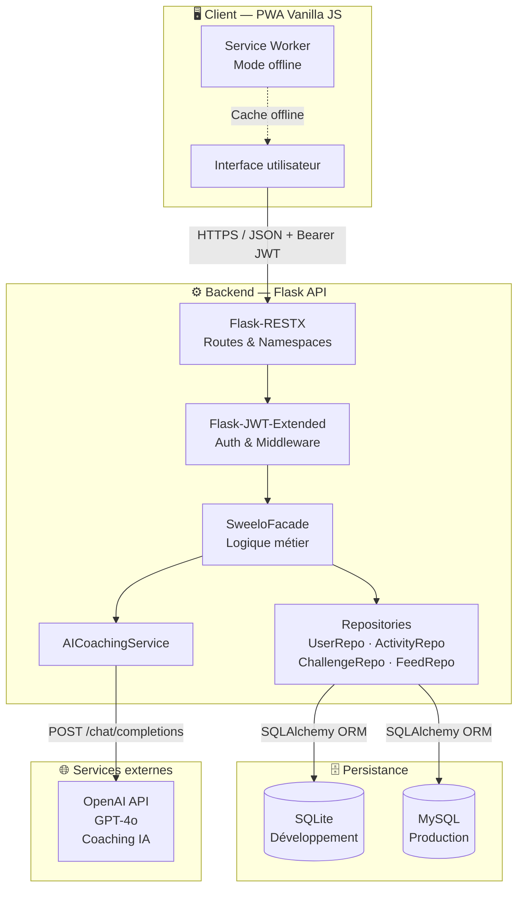
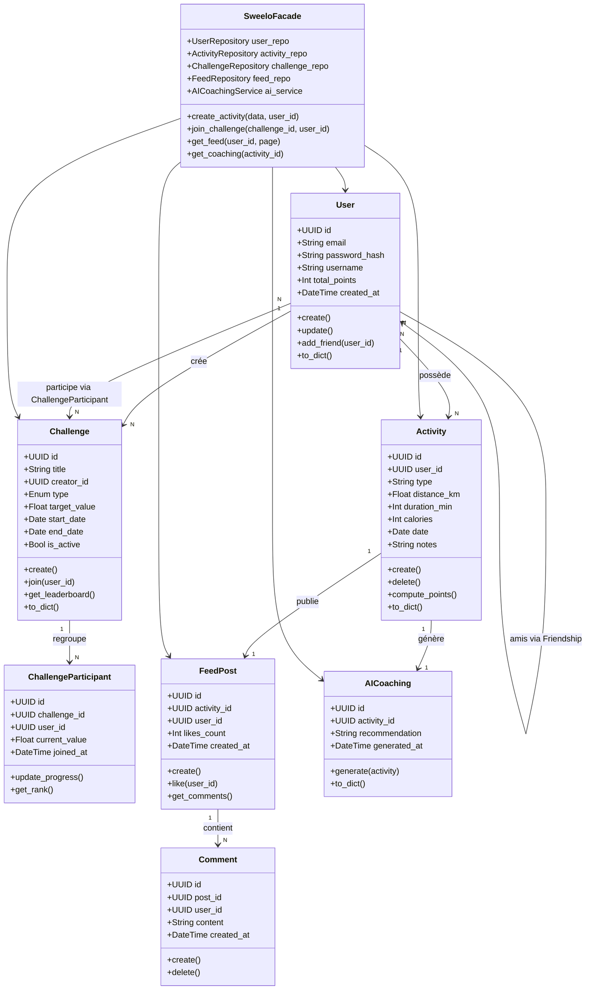
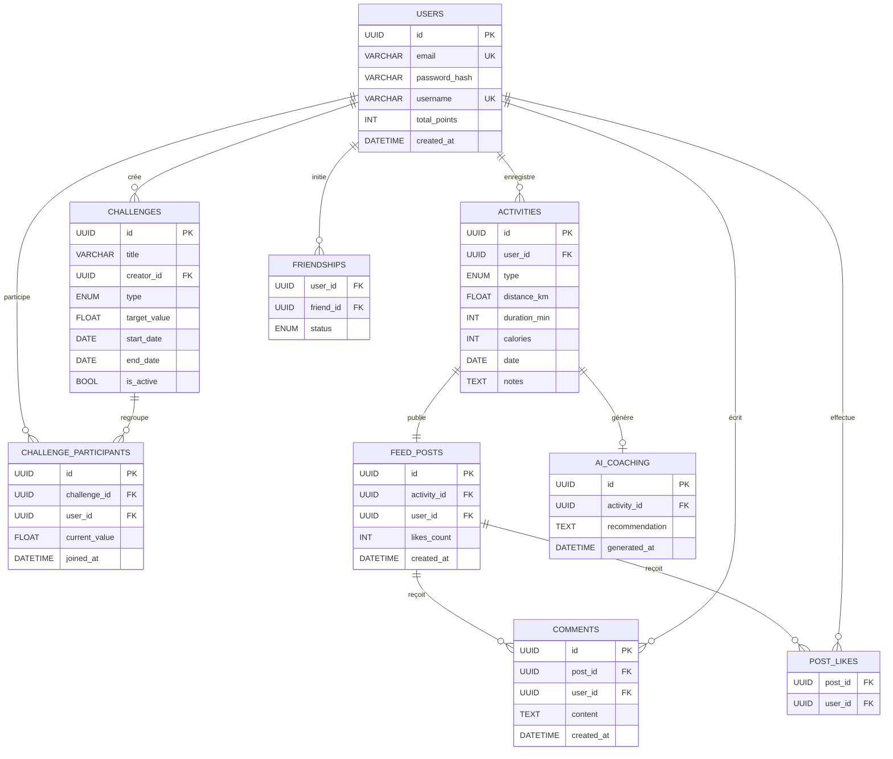
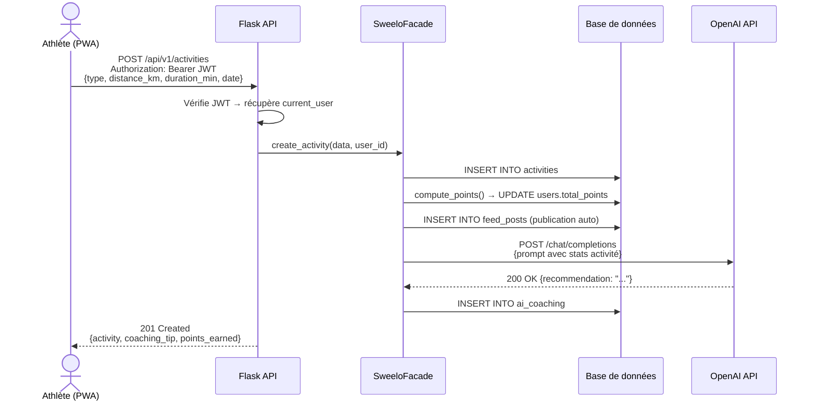
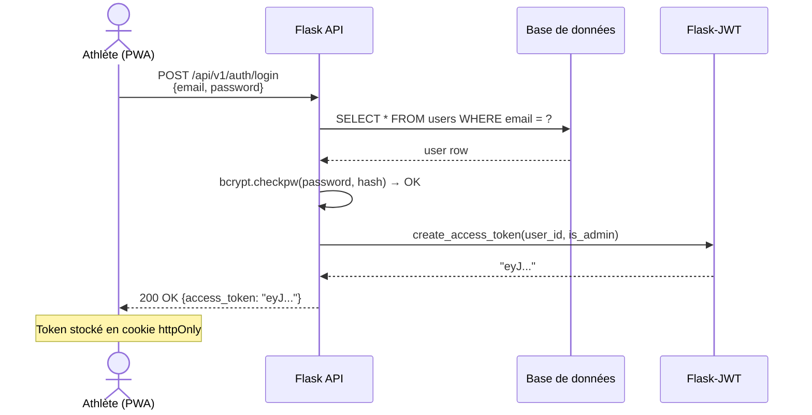
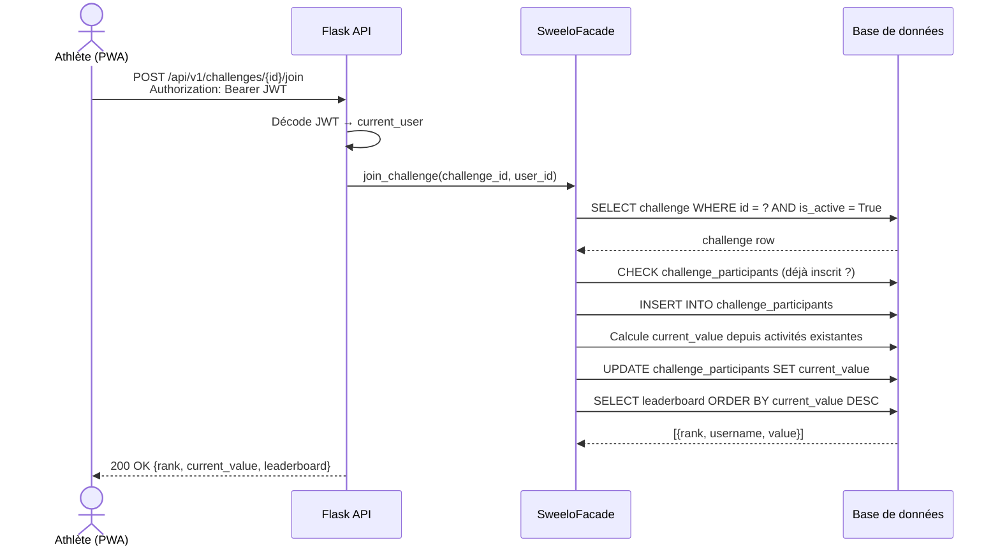
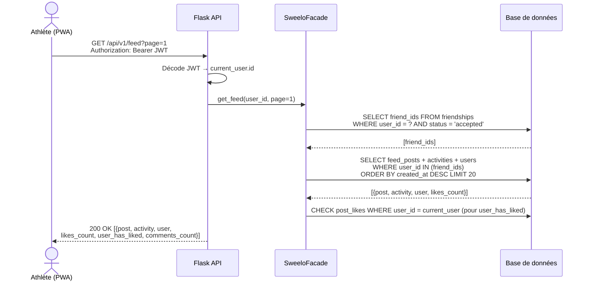
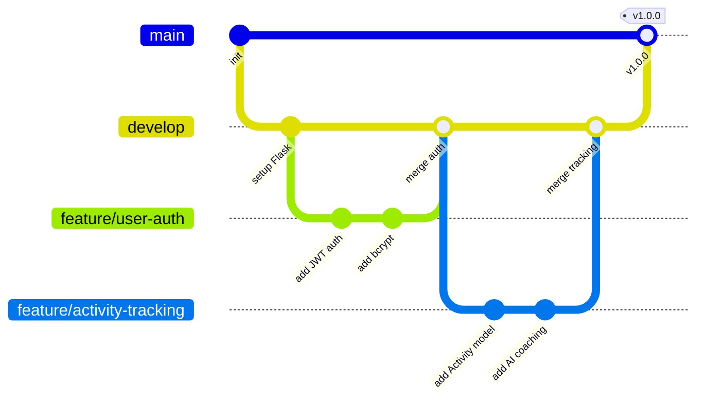

# SWEELO — Stage 3: Technical Documentation

> Application de tracking sportif, défis sociaux et coaching IA pour athlètes amateurs  
> **Stack :** Flask · SQLAlchemy · JWT · Vanilla JS PWA  
> **Équipe :** Arthur Moulard · Valentin Pasquiet  
> **Base de données :** SQLite (dev) → MySQL (prod)

---

## Table des matières

1. [User Stories & Maquettes](#1-user-stories--maquettes)
2. [Architecture Système](#2-architecture-système)
3. [Composants, Classes & Base de données](#3-composants-classes--base-de-données)
4. [Diagrammes de Séquence](#4-diagrammes-de-séquence)
5. [Spécifications API](#5-spécifications-api)
6. [SCM & QA](#6-scm--qa)
7. [Justifications Techniques](#7-justifications-techniques)

---

## 1. User Stories & Maquettes

### Méthode de priorisation : MoSCoW

#### Must Have — Cœur du MVP

| # | User Story | Priorité |
|---|------------|----------|
| US-01 | En tant qu'athlète, je veux créer un compte avec email/mot de passe, afin d'accéder à mes données personnalisées. | 🔴 Must |
| US-02 | En tant qu'athlète, je veux me connecter et obtenir un token JWT, afin d'accéder aux routes protégées. | 🔴 Must |
| US-03 | En tant qu'athlète, je veux enregistrer une activité (type, distance, durée, date), afin de suivre mes entraînements. | 🔴 Must |
| US-04 | En tant qu'athlète, je veux consulter l'historique de mes activités, afin de visualiser ma progression. | 🔴 Must |
| US-05 | En tant qu'athlète, je veux voir un feed social des activités de mes amis, afin de rester motivé. | 🔴 Must |
| US-06 | En tant qu'athlète, je veux créer ou rejoindre un défi (distance, durée, calories), afin de me mesurer à mes amis. | 🔴 Must |
| US-07 | En tant qu'athlète, je veux voir le classement d'un défi en temps réel, afin de connaître ma position. | 🔴 Must |

#### Should Have — Valeur ajoutée importante

| # | User Story | Priorité |
|---|------------|----------|
| US-08 | En tant qu'athlète, je veux recevoir une recommandation de coaching IA après chaque activité, afin d'améliorer mes performances. | 🟠 Should |
| US-09 | En tant qu'athlète, je veux gagner des points à chaque activité enregistrée, afin de débloquer des récompenses. | 🟠 Should |
| US-10 | En tant qu'athlète, je veux ajouter des amis via leur identifiant, afin de suivre leurs activités. | 🟠 Should |
| US-11 | En tant qu'athlète, je veux liker ou commenter une activité du feed, afin d'interagir avec mes amis. | 🟠 Should |

#### Could Have / Won't Have

| # | User Story | Priorité |
|---|------------|----------|
| US-12 | En tant qu'athlète, je veux tracker mon activité en temps réel via GPS depuis mon smartphone. | 🟡 Could |
| US-13 | En tant qu'athlète, je veux connecter ma montre via Bluetooth pour importer mes données automatiquement. | ⚪ Won't (MVP) |
| US-14 | En tant qu'athlète, je veux partager mon activité sur Instagram ou Twitter. | ⚪ Won't (MVP) |

### Maquettes — Écrans principaux

Les 4 écrans ci-dessous sont à réaliser sur Figma et à joindre en annexe :

| Écran | Contenu attendu | User Stories couvertes |
|-------|-----------------|------------------------|
| **Dashboard** | Résumé semaine, dernière activité, points cumulés, bouton "Enregistrer" | US-03, US-04, US-09 |
| **Feed social** | Liste activités amis, bouton like/commentaire, carte d'activité | US-05, US-11 |
| **Défis** | Mes défis actifs, classement, bouton rejoindre/créer | US-06, US-07 |
| **Profil** | Stats personnelles, historique, badges/récompenses, liste amis | US-04, US-09, US-10 |

---

## 2. Architecture Système

### Diagramme d'architecture haut niveau



### Stack technique

| Couche | Technologie | Rôle |
|--------|-------------|------|
| Frontend | Vanilla JS PWA | Interface utilisateur, Service Worker, Fetch API |
| Backend | Flask + Flask-RESTX | API REST, namespaces, documentation Swagger auto |
| Auth | Flask-JWT-Extended | Tokens JWT stateless, contrôle d'accès par rôle |
| ORM | SQLAlchemy | Abstraction BDD, Repository Pattern |
| BDD dev | SQLite | Zéro configuration, portable |
| BDD prod | MySQL | Robustesse, gestion de la concurrence |
| Coaching IA | OpenAI API (GPT-4o) | Génération de recommandations post-activité |
| Hashage | bcrypt | Stockage sécurisé des mots de passe (OWASP) |

---

## 3. Composants, Classes & Base de données

### Diagramme de classes



### Diagramme Entité-Relation (ER)



### Schéma détaillé des tables

| Table | Colonnes principales | Relations |
|-------|----------------------|-----------|
| `users` | id PK, email UNIQUE, password_hash, username UNIQUE, total_points, created_at | → activities (1-N), → challenges (créateur), ↔ users (amis) |
| `activities` | id PK, user_id FK, type ENUM(run/bike/swim/walk), distance_km, duration_min, calories, date, notes | ← users, → feed_posts (1-1), → ai_coaching (1-1) |
| `challenges` | id PK, title, creator_id FK, type ENUM(distance/duration/calories), target_value, start_date, end_date, is_active | ← users, ↔ users via challenge_participants |
| `challenge_participants` | id PK, challenge_id FK, user_id FK, current_value, joined_at | Table de liaison + progression |
| `feed_posts` | id PK, activity_id FK UNIQUE, user_id FK, likes_count, created_at | ← activities, → comments (1-N), ↔ users via post_likes |
| `comments` | id PK, post_id FK, user_id FK, content, created_at | ← feed_posts, ← users |
| `post_likes` | post_id FK, user_id FK — PK composite | Table de liaison N-N |
| `friendships` | user_id FK, friend_id FK — PK composite, status ENUM(pending/accepted) | Table auto-référentielle N-N |
| `ai_coaching` | id PK, activity_id FK UNIQUE, recommendation TEXT, generated_at | ← activities |

---

## 4. Diagrammes de Séquence

### Flux 1 — Enregistrement d'une activité + coaching IA



### Flux 2 — Authentification & JWT



### Flux 3 — Rejoindre un défi & mise à jour du classement



### Flux 4 — Consultation du feed social



---

## 5. Spécifications API

### APIs externes utilisées

| Service | Endpoint utilisé | Usage | Justification |
|---------|-----------------|-------|---------------|
| **OpenAI API** (GPT-4o) | `POST /v1/chat/completions` | Génération de recommandations coaching après chaque activité | Modèle puissant pour analyse contextuelle sportive. Appel côté serveur pour protéger la clé API. Réponse mise en cache en BDD. |

### Endpoints internes — Authentification

| Méthode | Route | Auth | Body | Réponse |
|---------|-------|------|------|---------|
| `POST` | `/api/v1/auth/register` | — | `{email, password, username}` | `201 {id, email, username}` |
| `POST` | `/api/v1/auth/login` | — | `{email, password}` | `200 {access_token}` |

### Endpoints internes — Activités

| Méthode | Route | Auth | Body / Params | Réponse |
|---------|-------|------|---------------|---------|
| `GET` | `/api/v1/activities` | JWT | `?page=1&limit=20` | `200 [{activity}]` de l'user courant |
| `POST` | `/api/v1/activities` | JWT | `{type, distance_km, duration_min, calories, date, notes}` | `201 {activity, coaching_tip, points_earned}` |
| `GET` | `/api/v1/activities/:id` | JWT | — | `200 {activity + coaching}` / `404` |
| `DELETE` | `/api/v1/activities/:id` | JWT + owner | — | `204` / `403` |

### Endpoints internes — Défis

| Méthode | Route | Auth | Body / Params | Réponse |
|---------|-------|------|---------------|---------|
| `GET` | `/api/v1/challenges` | JWT | `?active=true` | `200 [{challenge, participants_count}]` |
| `POST` | `/api/v1/challenges` | JWT | `{title, type, target_value, start_date, end_date}` | `201 {challenge}` |
| `POST` | `/api/v1/challenges/:id/join` | JWT | — | `200 {rank, current_value, leaderboard}` |
| `GET` | `/api/v1/challenges/:id/leaderboard` | JWT | — | `200 [{rank, username, value}]` |

### Endpoints internes — Feed & Social

| Méthode | Route | Auth | Body / Params | Réponse |
|---------|-------|------|---------------|---------|
| `GET` | `/api/v1/feed` | JWT | `?page=1` | `200 [{post, activity, user, likes_count, user_has_liked, comments_count}]` |
| `POST` | `/api/v1/feed/:id/like` | JWT | — | `200 {likes_count, liked: true}` |
| `POST` | `/api/v1/feed/:id/comments` | JWT | `{content}` | `201 {comment}` |
| `POST` | `/api/v1/users/:id/friend` | JWT | — | `200 {status: "pending"}` |
| `PUT` | `/api/v1/users/:id/friend` | JWT | `{action: "accept"/"reject"}` | `200 {status: "accepted"}` |

### Endpoints internes — Profil & Statistiques

| Méthode | Route | Auth | Réponse |
|---------|-------|------|---------|
| `GET` | `/api/v1/users/me` | JWT | `200 {user, total_points, activities_count, friends_count}` |
| `PUT` | `/api/v1/users/me` | JWT | `200 {user mis à jour}` |
| `GET` | `/api/v1/users/me/stats` | JWT | `200 {total_km, total_min, total_calories, weekly_summary}` |

### Format de réponse standard

```json
// Succès
{
  "status": "success",
  "data": { ... }
}

// Erreur
{
  "status": "error",
  "message": "Description de l'erreur",
  "code": 401
}
```

---

## 6. SCM & QA

### Stratégie SCM (Git)

#### Branches

```
main
 └── develop
      ├── feature/user-auth
      ├── feature/activity-tracking
      ├── feature/challenge-leaderboard
      ├── feature/feed-social
      ├── feature/ai-coaching
      ├── fix/feed-pagination
      └── chore/add-pytest-config
```



#### Conventions de commits

| Préfixe | Usage |
|---------|-------|
| `feat:` | Nouvelle fonctionnalité |
| `fix:` | Correction de bug |
| `test:` | Ajout ou modification de tests |
| `docs:` | Documentation |
| `refactor:` | Refactoring sans changement de comportement |
| `chore:` | Config, dépendances, CI |

**Exemple :** `feat: add POST /activities endpoint with AI coaching`

#### Processus de merge

- Toute fonctionnalité passe par une **Pull Request** vers `develop`
- **Revue de code obligatoire** par l'autre membre de l'équipe
- Tous les tests doivent passer avant le merge
- Squash + merge recommandé pour garder l'historique propre
- Merge dans `main` uniquement pour les releases stables (tag de version)

### Stratégie QA (Tests)

#### Types de tests

| Type | Outil | Scope | Objectif |
|------|-------|-------|----------|
| **Unitaires** | `pytest` | Modèles, Façade, calcul de points, service IA (mock) | Couverture ≥ 80% |
| **Intégration** | `pytest` + Flask test client | Tous les endpoints API, JWT sur routes protégées | Flux CRUD complets |
| **Manuels** | Postman (collection partagée) | Flux end-to-end, cas d'erreur (401, 403, 404, 409) | Validation UX |
| **CI** | GitHub Actions | `pytest` + `flake8` lint sur chaque push | Blocage merge si échec |

#### Structure des tests

```
tests/
├── unit/
│   ├── test_user_model.py
│   ├── test_activity_model.py
│   ├── test_challenge_model.py
│   ├── test_facade.py
│   └── test_ai_service.py       # mock OpenAI
├── integration/
│   ├── test_auth_endpoints.py
│   ├── test_activity_endpoints.py
│   ├── test_challenge_endpoints.py
│   └── test_feed_endpoints.py
└── conftest.py                  # fixtures (app, db, JWT tokens)
```

#### Exemple de test unitaire

```python
# tests/unit/test_activity_model.py
def test_compute_points_run():
    activity = Activity(type="run", distance_km=10, duration_min=60)
    assert activity.compute_points() == 100  # 10 pts/km

def test_compute_points_minimum():
    activity = Activity(type="walk", distance_km=0.5, duration_min=10)
    assert activity.compute_points() >= 5  # points minimum
```

---

## 7. Justifications Techniques

### Flask + Flask-RESTX

**Choix :** Framework micro Python léger pour API REST.  
**Justification :** Flask-RESTX impose une structure par namespaces et génère automatiquement la documentation Swagger. Django serait surdimensionné pour un MVP de 2 développeurs sans beaucoup d'ORM natif — Flask laisse le contrôle total sur l'architecture.

### SQLAlchemy (ORM) + Repository Pattern

**Choix :** ORM Python avec pattern Repository.  
**Justification :** Abstraction complète de la BDD — passage de SQLite (dev) à MySQL (prod) sans modifier le code applicatif. Le Repository Pattern découple la logique métier de la persistance, permettant de tester avec une `InMemoryRepository` sans base de données réelle.

### JWT (Flask-JWT-Extended)

**Choix :** Authentification stateless par tokens JWT.  
**Justification :** Aucune session serveur à gérer — scalabilité horizontale facilitée. Le token contient l'`id` et le rôle (`is_admin`) de l'utilisateur, éliminant un aller-retour BDD supplémentaire par requête protégée. Compatible PWA sans cookie de session traditionnel.

### bcrypt

**Choix :** Algorithme de hashage adaptatif pour les mots de passe.  
**Justification :** bcrypt inclut un salt automatique et est résistant aux attaques brute-force et rainbow tables grâce à son coût computationnel réglable. Recommandation officielle de l'OWASP pour le stockage des mots de passe. Supérieur à SHA-256 ou MD5 pour cet usage.

### Façade Pattern

**Choix :** Couche d'orchestration entre routes et repositories.  
**Justification :** Chaque endpoint Flask appelle uniquement la `SweeloFacade`, qui orchestre les repositories et services externes (IA). Cela rend le code testable unitairement sans démarrer le serveur web, et facilite l'évolution des règles métier sans toucher aux routes.

### OpenAI API (GPT-4o) — Coaching IA

**Choix :** API externe LLM pour les recommandations sportives personnalisées.  
**Justification :** GPT-4o offre une capacité de contextualisation supérieure pour l'analyse sportive. L'appel est effectué **côté serveur** (via Flask) pour protéger la clé API. La recommandation générée est mise en cache en BDD dans `ai_coaching`, évitant des appels redondants pour la même activité.

### PWA Vanilla JS

**Choix :** Progressive Web App en JavaScript natif sans framework.  
**Justification :** Aucune dépendance frontend, chargement quasi-instantané. La Fetch API native suffit pour consommer l'API REST. Le **Service Worker** permet le mode offline — essentiel pour une app sportive utilisée en extérieur avec une connexion instable. React ou Vue ajouteraient une complexité de build non justifiée pour le MVP.

### SQLite (dev) → MySQL (prod)

**Choix :** Double configuration base de données selon l'environnement.  
**Justification :** SQLite ne nécessite aucune configuration pour le développement local (fichier unique `.db`). La migration vers MySQL en production est transparente grâce à SQLAlchemy — une seule variable d'environnement `DATABASE_URL` à changer. MySQL gère la concurrence multi-utilisateurs et les volumes de données attendus en production.

---

*Documentation rédigée dans le cadre du cursus Holberton School — RNCP Niveau 5*