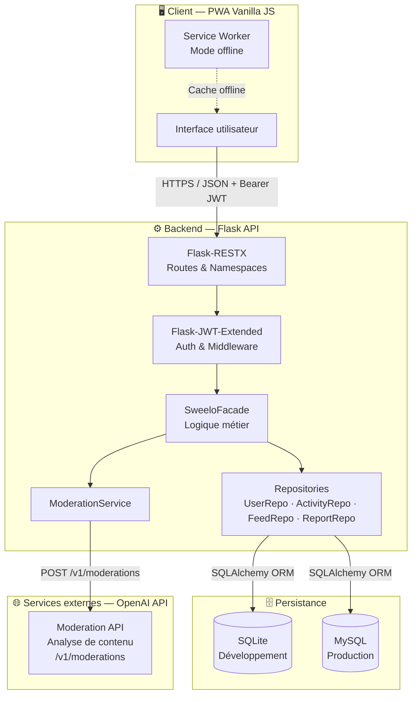
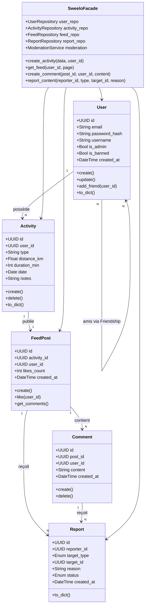
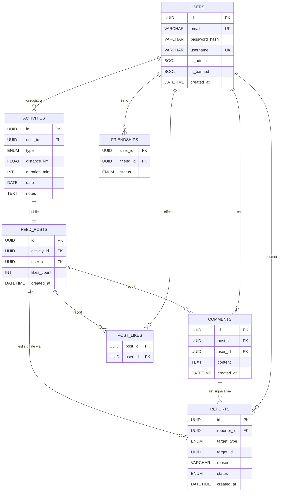
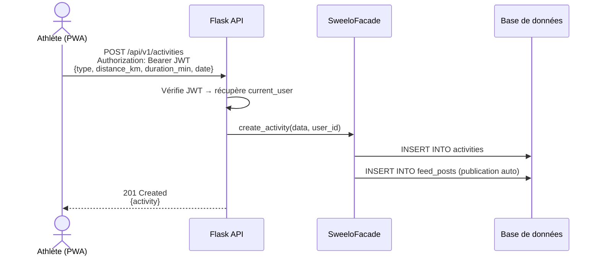
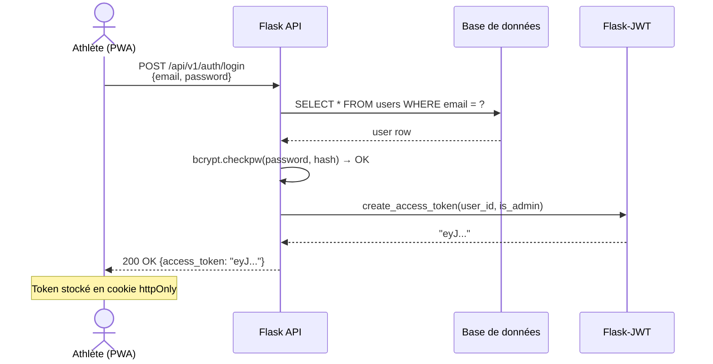
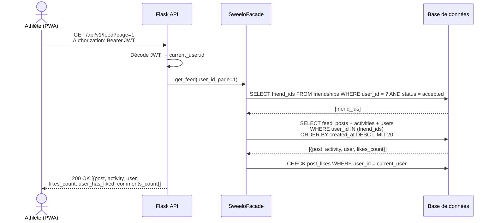
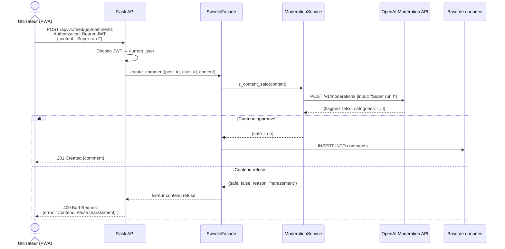
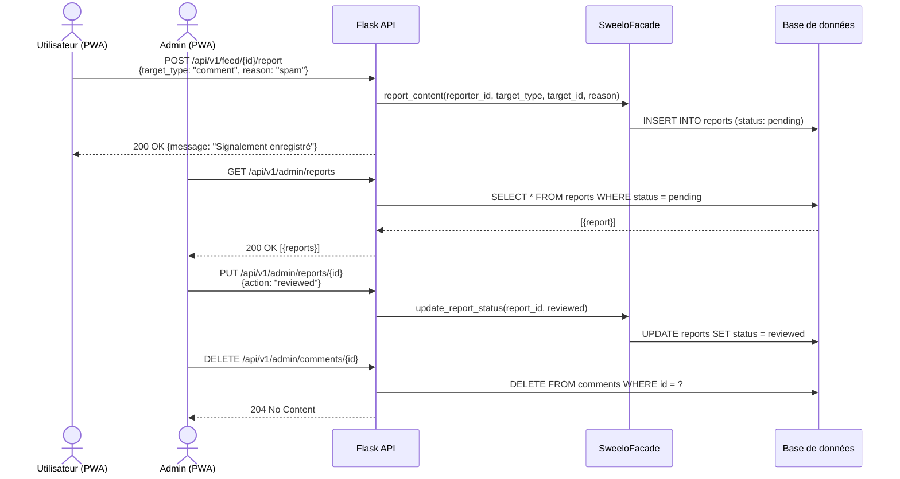
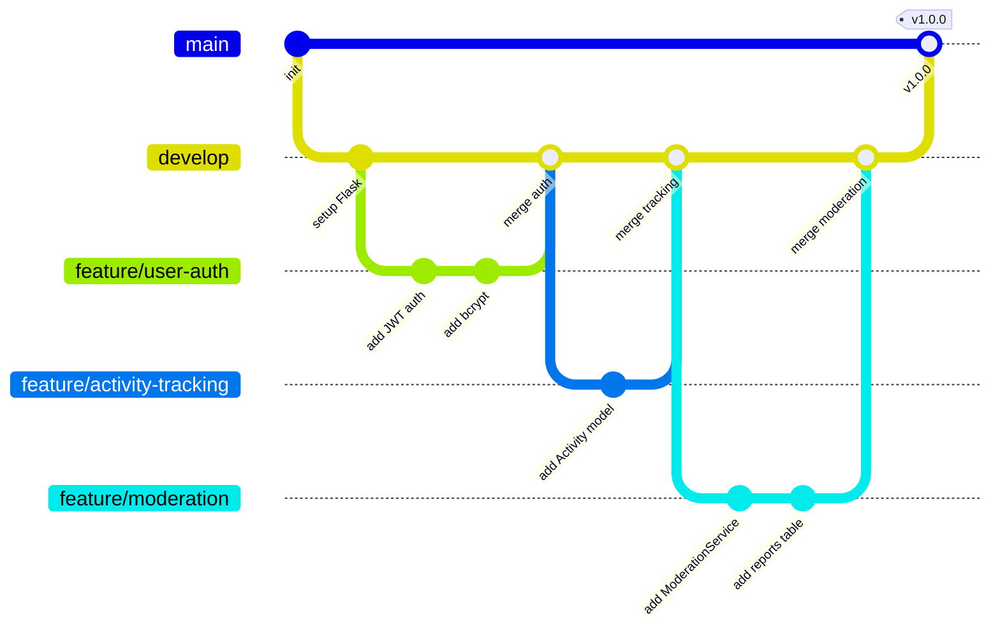

# Sweelo — Stage 3 : Documentation Technique

> Application de tracking sportif et réseau social sportif pour athlètes amateurs
> **Stack :** Flask · SQLAlchemy · JWT · Vanilla JS PWA
> **Équipe :** Arthur Moulard · Valentin Pasquiet
> **Base de données :** SQLite (dev) → MySQL (prod)

---

## Table des matières

1. [User Stories & Maquettes](#1-user-stories--maquettes)
2. [Architecture Système](#2-architecture-système)
3. [Composants, Classes & Base de données](#3-composants-classes--base-de-données)
4. [Diagrammes de Séquence](#4-diagrammes-de-séquence)
5. [Spécifications API](#5-spécifications-api)
6. [Modération de contenu](#6-modération-de-contenu)
7. [SCM & QA](#7-scm--qa)
8. [Justifications Techniques](#8-justifications-techniques)

---

## 1. User Stories & Maquettes

### Méthode de priorisation : MoSCoW

#### Must Have — Cœur du MVP

| # | User Story | Priorité |
|---|------------|----------|
| US-01 | En tant qu'athlète, je veux créer un compte avec email/mot de passe, afin d'accéder à mes données personnalisées. | 🔴 Must |
| US-02 | En tant qu'athlète, je veux me connecter et obtenir un token JWT, afin d'accéder aux routes protégées. | 🔴 Must |
| US-03 | En tant qu'athlète, je veux enregistrer une activité (type, distance, durée, date), afin de suivre mes entraînements. | 🔴 Must |
| US-04 | En tant qu'athlète, je veux consulter l'historique de mes activités, afin de visualiser ma progression. | 🔴 Must |
| US-05 | En tant qu'athlète, je veux voir un feed social des activités de mes amis, afin de rester motivé. | 🔴 Must |
| US-06 | En tant qu'admin, je veux bannir ou supprimer un utilisateur, afin d'assainir la communauté. | 🔴 Must |
| US-07 | En tant qu'utilisateur, je veux signaler un post ou un commentaire, afin d'alerter les modérateurs d'un contenu inapproprié. | 🔴 Must |
| US-08 | En tant que système, je veux soumettre chaque post ou commentaire à l'OpenAI Moderation API avant insertion, afin de bloquer automatiquement les contenus toxiques. | 🔴 Must |

#### Should Have — Valeur ajoutée importante

| # | User Story | Priorité |
|---|------------|----------|
| US-09 | En tant qu'athlète, je veux ajouter des amis via leur identifiant, afin de suivre leurs activités. | 🟠 Should |
| US-10 | En tant qu'athlète, je veux liker ou commenter une activité du feed, afin d'interagir avec mes amis. | 🟠 Should |
| US-11 | En tant qu'admin, je veux consulter et traiter les signalements, afin de modérer la plateforme manuellement. | 🟠 Should |
| US-12 | En tant qu'admin, je veux supprimer un post ou un commentaire signalé, afin de modérer le contenu inapproprié. | 🟠 Should |

#### Could Have / Won't Have

| # | User Story | Priorité |
|---|------------|----------|
| US-13 | En tant qu'athlète, je veux tracker mon activité en temps réel via GPS depuis mon smartphone. | 🟡 Could |
| US-14 | En tant qu'athlète, je veux connecter ma montre via Bluetooth pour importer mes données automatiquement. | ⚪ Won't (MVP) |
| US-15 | En tant qu'athlète, je veux partager mon activité sur Instagram ou Twitter. | ⚪ Won't (MVP) |

### Maquettes — Écrans principaux

Les maquettes interactives ci-dessous couvrent l'ensemble des écrans du MVP, organisés par rôle (utilisateur et admin). Chaque écran est navigable via le menu latéral et correspond aux user stories associées.

| Écran | Contenu attendu | User Stories couvertes |
|-------|-----------------|------------------------|
| **Inscription** | Formulaire de création de compte | US-01 |
| **Connexion** | Formulaire login + retour token JWT | US-02 |
| **Log activité** | Sélection type, distance, durée, date, note | US-03 |
| **Historique** | Stats du mois, graphe semaine, liste activités filtrables | US-04 |
| **Feed social** | Activités amis, like, commentaire, bouton signaler | US-05, US-07, US-10 |
| **Admin — Utilisateurs** | Stats globales, liste utilisateurs, bannir/avertir | US-06 |
| **Admin — Modération** | File signalements, score OpenAI, actions bloquer/valider | US-08, US-11, US-12 |


<style>
  * { box-sizing: border-box; margin: 0; padding: 0; }
  :root {
    --sw-bg: #0f1014;
    --sw-surface: #17191f;
    --sw-card: #1e2128;
    --sw-border: rgba(255,255,255,0.08);
    --sw-orange: #f97316;
    --sw-orange-light: #fb923c;
    --sw-text: #f1f5f9;
    --sw-muted: #94a3b8;
    --sw-dim: #475569;
    --sw-green: #22c55e;
    --sw-red: #ef4444;
    --sw-blue: #3b82f6;
    --sw-amber: #f59e0b;
  }
  body { font-family: var(--font-sans, sans-serif); background: transparent; }
  .wrap { display: flex; gap: 0; border: 0.5px solid var(--color-border-tertiary); border-radius: var(--border-radius-lg); overflow: hidden; background: var(--color-background-secondary); }
  .nav { width: 190px; flex-shrink: 0; padding: 16px 12px; display: flex; flex-direction: column; gap: 2px; border-right: 0.5px solid var(--color-border-tertiary); }
  .nav-label { font-size: 10px; font-weight: 500; color: var(--color-text-tertiary); text-transform: uppercase; letter-spacing: 0.08em; padding: 8px 8px 4px; }
  .nav-btn { display: flex; align-items: center; gap: 8px; padding: 7px 10px; border-radius: 6px; border: none; background: none; cursor: pointer; font-size: 12.5px; color: var(--color-text-secondary); text-align: left; width: 100%; transition: background 0.15s; }
  .nav-btn:hover { background: var(--color-background-primary); }
  .nav-btn.active { background: var(--color-background-info); color: var(--color-text-info); font-weight: 500; }
  .nav-btn i { font-size: 15px; flex-shrink: 0; }
  .us-badge { margin-left: auto; font-size: 10px; color: var(--color-text-tertiary); }
  .nav-btn.active .us-badge { color: var(--color-text-info); opacity: 0.7; }
  .screen-wrap { flex: 1; min-width: 0; overflow: hidden; }
  .phone-outer { padding: 20px; display: flex; justify-content: center; background: var(--color-background-tertiary); min-height: 560px; align-items: flex-start; }
  .phone { width: 300px; background: #0f1014; border-radius: 28px; overflow: hidden; border: 2px solid rgba(255,255,255,0.12); box-shadow: 0 0 0 1px rgba(0,0,0,0.5); flex-shrink: 0; }
  .phone-status { display: flex; justify-content: space-between; align-items: center; padding: 10px 18px 4px; }
  .phone-status span { font-size: 11px; color: rgba(255,255,255,0.7); font-weight: 500; }
  .screen { display: none; }
  .screen.active { display: block; }
  .sw-header { padding: 12px 16px 10px; display: flex; align-items: center; gap: 10px; border-bottom: 0.5px solid rgba(255,255,255,0.06); }
  .sw-logo { font-size: 15px; font-weight: 700; color: #f97316; letter-spacing: -0.03em; }
  .sw-header-title { font-size: 14px; font-weight: 500; color: #f1f5f9; flex: 1; }
  .sw-back { font-size: 18px; color: #94a3b8; cursor: pointer; }
  .sw-body { padding: 16px; }
  .sw-field { margin-bottom: 12px; }
  .sw-label { font-size: 11px; color: #94a3b8; margin-bottom: 5px; }
  .sw-input { background: #1e2128; border: 0.5px solid rgba(255,255,255,0.1); border-radius: 8px; padding: 9px 12px; color: #f1f5f9; font-size: 13px; width: 100%; }
  .sw-input.focused { border-color: #f97316; }
  .sw-btn { background: #f97316; color: #fff; border: none; border-radius: 8px; padding: 11px; width: 100%; font-size: 13px; font-weight: 600; cursor: pointer; text-align: center; }
  .sw-btn.secondary { background: transparent; border: 0.5px solid rgba(255,255,255,0.15); color: #94a3b8; }
  .sw-subtitle { font-size: 11px; color: #94a3b8; text-align: center; margin-top: 10px; }
  .sw-subtitle span { color: #f97316; }
  .sw-divider { height: 0.5px; background: rgba(255,255,255,0.06); margin: 14px 0; }
  .stat-row { display: flex; gap: 8px; margin-bottom: 14px; }
  .stat-card { flex: 1; background: #1e2128; border-radius: 10px; padding: 10px; }
  .stat-num { font-size: 18px; font-weight: 700; color: #f1f5f9; }
  .stat-unit { font-size: 10px; color: #94a3b8; margin-top: 1px; }
  .act-item { background: #1e2128; border-radius: 10px; padding: 12px; margin-bottom: 8px; }
  .act-head { display: flex; justify-content: space-between; align-items: center; margin-bottom: 6px; }
  .act-type { font-size: 12px; font-weight: 600; color: #f1f5f9; display: flex; align-items: center; gap: 5px; }
  .act-type i { color: #f97316; font-size: 14px; }
  .act-date { font-size: 10px; color: #475569; }
  .act-stats { display: flex; gap: 12px; }
  .act-stat { font-size: 11px; color: #94a3b8; }
  .act-stat b { color: #f1f5f9; }
  .bottom-nav { display: flex; border-top: 0.5px solid rgba(255,255,255,0.06); padding: 8px 0 4px; }
  .bn-item { flex: 1; display: flex; flex-direction: column; align-items: center; gap: 2px; }
  .bn-item i { font-size: 19px; color: #475569; }
  .bn-item.active i { color: #f97316; }
  .bn-item span { font-size: 9px; color: #475569; }
  .bn-item.active span { color: #f97316; }
  .feed-item { background: #1e2128; border-radius: 10px; padding: 12px; margin-bottom: 8px; }
  .feed-user { display: flex; align-items: center; gap: 8px; margin-bottom: 8px; }
  .avatar { width: 30px; height: 30px; border-radius: 50%; display: flex; align-items: center; justify-content: center; font-size: 11px; font-weight: 700; flex-shrink: 0; }
  .avatar.a1 { background: #1d4ed8; color: #bfdbfe; }
  .avatar.a2 { background: #15803d; color: #bbf7d0; }
  .avatar.a3 { background: #7c3aed; color: #ddd6fe; }
  .feed-name { font-size: 12px; font-weight: 600; color: #f1f5f9; }
  .feed-time { font-size: 10px; color: #475569; }
  .feed-content { font-size: 12px; color: #cbd5e1; margin-bottom: 8px; }
  .feed-metrics { display: flex; gap: 10px; }
  .feed-metric { background: #17191f; border-radius: 5px; padding: 3px 7px; font-size: 10px; color: #94a3b8; }
  .feed-metric b { color: #f97316; }
  .feed-actions { display: flex; gap: 8px; margin-top: 8px; }
  .feed-action { display: flex; align-items: center; gap: 3px; font-size: 10px; color: #475569; }
  .feed-action i { font-size: 12px; }
  .admin-user { background: #1e2128; border-radius: 10px; padding: 10px 12px; margin-bottom: 7px; display: flex; align-items: center; gap: 10px; }
  .admin-info { flex: 1; }
  .admin-name { font-size: 12px; font-weight: 600; color: #f1f5f9; }
  .admin-meta { font-size: 10px; color: #475569; }
  .admin-actions { display: flex; gap: 5px; }
  .admin-btn { padding: 4px 8px; border-radius: 5px; font-size: 10px; font-weight: 600; border: none; cursor: pointer; }
  .admin-btn.warn { background: rgba(245,158,11,0.15); color: #f59e0b; }
  .admin-btn.danger { background: rgba(239,68,68,0.15); color: #ef4444; }
  .badge { display: inline-flex; align-items: center; gap: 3px; padding: 2px 7px; border-radius: 20px; font-size: 10px; font-weight: 600; }
  .badge.ok { background: rgba(34,197,94,0.15); color: #22c55e; }
  .badge.blocked { background: rgba(239,68,68,0.15); color: #ef4444; }
  .badge.pending { background: rgba(245,158,11,0.15); color: #f59e0b; }
  .mod-item { background: #1e2128; border-radius: 10px; padding: 11px 12px; margin-bottom: 7px; }
  .mod-head { display: flex; justify-content: space-between; align-items: center; margin-bottom: 6px; }
  .mod-author { font-size: 11px; color: #94a3b8; }
  .mod-content { font-size: 12px; color: #cbd5e1; margin-bottom: 7px; background: rgba(0,0,0,0.3); padding: 6px 8px; border-radius: 6px; border-left: 2px solid rgba(239,68,68,0.5); }
  .mod-ai { display: flex; align-items: center; gap: 5px; margin-bottom: 6px; }
  .mod-ai-label { font-size: 10px; color: #475569; }
  .mod-score { font-size: 10px; font-weight: 700; }
  .mod-score.high { color: #ef4444; }
  .mod-score.low { color: #22c55e; }
  .mod-footer { display: flex; gap: 5px; }
  .form-select { background: #1e2128; border: 0.5px solid rgba(255,255,255,0.1); border-radius: 8px; padding: 9px 12px; color: #f1f5f9; font-size: 13px; width: 100%; }
  .type-grid { display: grid; grid-columns: repeat(3,1fr); grid-template-columns: repeat(3,1fr); gap: 7px; margin-bottom: 12px; }
  .type-btn { background: #1e2128; border: 0.5px solid rgba(255,255,255,0.08); border-radius: 8px; padding: 10px 6px; display: flex; flex-direction: column; align-items: center; gap: 4px; cursor: pointer; }
  .type-btn.active { border-color: #f97316; background: rgba(249,115,22,0.1); }
  .type-btn i { font-size: 18px; color: #94a3b8; }
  .type-btn.active i { color: #f97316; }
  .type-btn span { font-size: 10px; color: #475569; }
  .type-btn.active span { color: #f97316; }
  .section-title { font-size: 11px; font-weight: 600; color: #94a3b8; letter-spacing: 0.05em; text-transform: uppercase; margin-bottom: 8px; }
  .admin-stat { background: #1e2128; border-radius: 8px; padding: 8px 10px; flex: 1; }
  .admin-stat-val { font-size: 18px; font-weight: 700; color: #f1f5f9; }
  .admin-stat-label { font-size: 9px; color: #475569; text-transform: uppercase; letter-spacing: 0.04em; }
  .filter-row { display: flex; gap: 5px; margin-bottom: 10px; }
  .filter-btn { padding: 4px 9px; border-radius: 20px; font-size: 10px; font-weight: 500; border: 0.5px solid rgba(255,255,255,0.1); background: transparent; color: #94a3b8; cursor: pointer; }
  .filter-btn.active { background: rgba(249,115,22,0.15); border-color: #f97316; color: #f97316; }
  .chart-bar-wrap { display: flex; align-items: flex-end; gap: 4px; height: 55px; margin-bottom: 4px; }
  .chart-bar { flex: 1; background: rgba(249,115,22,0.3); border-radius: 3px 3px 0 0; position: relative; }
  .chart-bar.today { background: #f97316; }
  .chart-labels { display: flex; gap: 4px; }
  .chart-label { flex: 1; font-size: 8px; color: #475569; text-align: center; }
  .progress-ring-wrap { display: flex; justify-content: center; margin: 10px 0; position: relative; }
  .prog-label { position: absolute; top: 50%; left: 50%; transform: translate(-50%,-50%); text-align: center; }
  .prog-val { font-size: 18px; font-weight: 700; color: #f1f5f9; }
  .prog-sub { font-size: 9px; color: #475569; }
</style>

<h2 class="sr-only">Maquettes Sweelo — navigation par écrans</h2>

<div class="wrap">
  <div class="nav">
    <div class="nav-label">Utilisateur</div>
    <button class="nav-btn active" onclick="show('register')"><i class="ti ti-user-plus" aria-hidden="true"></i> Inscription <span class="us-badge">01</span></button>
    <button class="nav-btn" onclick="show('login')"><i class="ti ti-login" aria-hidden="true"></i> Connexion <span class="us-badge">02</span></button>
    <button class="nav-btn" onclick="show('log')"><i class="ti ti-plus-circle" aria-hidden="true"></i> Log activité <span class="us-badge">03</span></button>
    <button class="nav-btn" onclick="show('history')"><i class="ti ti-history" aria-hidden="true"></i> Historique <span class="us-badge">04</span></button>
    <button class="nav-btn" onclick="show('feed')"><i class="ti ti-layout-list" aria-hidden="true"></i> Feed social <span class="us-badge">05</span></button>
    <div class="nav-label" style="margin-top:8px">Admin</div>
    <button class="nav-btn" onclick="show('admin-users')"><i class="ti ti-users-group" aria-hidden="true"></i> Utilisateurs <span class="us-badge">06</span></button>
    <button class="nav-btn" onclick="show('admin-mod')"><i class="ti ti-shield-check" aria-hidden="true"></i> Modération <span class="us-badge">07-08</span></button>
  </div>

  <div class="screen-wrap">
    <div class="phone-outer">
      <div class="phone">
        <div class="phone-status">
          <span>9:41</span>
          <span style="display:flex;gap:4px;align-items:center"><i class="ti ti-wifi" style="font-size:12px" aria-hidden="true"></i><i class="ti ti-battery-2" style="font-size:12px" aria-hidden="true"></i></span>
        </div>

        <!-- REGISTER -->
        <div class="screen active" id="screen-register">
          <div class="sw-header"><span class="sw-logo">Sweelo</span></div>
          <div class="sw-body">
            <div style="margin-bottom:18px">
              <div style="font-size:18px;font-weight:700;color:#f1f5f9;margin-bottom:3px">Créer un compte</div>
              <div style="font-size:11px;color:#475569">Rejoins la communauté Sweelo</div>
            </div>
            <div class="sw-field"><div class="sw-label">Prénom &amp; nom</div><div class="sw-input">Arthur Dupont</div></div>
            <div class="sw-field"><div class="sw-label">Email</div><div class="sw-input focused">arthur@example.com</div></div>
            <div class="sw-field"><div class="sw-label">Mot de passe</div><div class="sw-input">••••••••</div></div>
            <div style="margin-bottom:14px">
              <div class="sw-field"><div class="sw-label">Confirmer le mot de passe</div><div class="sw-input">••••••••</div></div>
            </div>
            <div class="sw-btn">Créer mon compte</div>
            <div class="sw-subtitle">Déjà inscrit ? <span>Se connecter</span></div>
          </div>
        </div>

        <!-- LOGIN -->
        <div class="screen" id="screen-login">
          <div class="sw-header"><span class="sw-logo">Sweelo</span></div>
          <div class="sw-body">
            <div style="margin-bottom:18px">
              <div style="font-size:18px;font-weight:700;color:#f1f5f9;margin-bottom:3px">Bon retour 👋</div>
              <div style="font-size:11px;color:#475569">Connecte-toi pour continuer</div>
            </div>
            <div class="sw-field"><div class="sw-label">Email</div><div class="sw-input">arthur@example.com</div></div>
            <div class="sw-field"><div class="sw-label">Mot de passe</div><div class="sw-input focused">••••••••</div></div>
            <div style="text-align:right;margin-bottom:14px"><span style="font-size:11px;color:#f97316">Mot de passe oublié ?</span></div>
            <div class="sw-btn">Se connecter</div>
            <div class="sw-divider"></div>
            <div style="font-size:10px;color:#475569;text-align:center;margin-bottom:8px">Token JWT stocké en cookie HttpOnly</div>
            <div style="background:rgba(249,115,22,0.07);border-radius:7px;padding:7px 10px;border-left:2px solid #f97316">
              <div style="font-size:10px;color:#94a3b8">Réponse API</div>
              <div style="font-size:10px;color:#f97316;font-family:var(--font-mono)">{ "access_token": "eyJ..." }</div>
            </div>
          </div>
        </div>

        <!-- LOG ACTIVITY -->
        <div class="screen" id="screen-log">
          <div class="sw-header">
            <i class="ti ti-arrow-left sw-back" aria-hidden="true"></i>
            <span class="sw-header-title">Enregistrer une activité</span>
          </div>
          <div class="sw-body">
            <div class="section-title">Type d'activité</div>
            <div class="type-grid">
              <div class="type-btn active"><i class="ti ti-run" aria-hidden="true"></i><span>Course</span></div>
              <div class="type-btn"><i class="ti ti-bike" aria-hidden="true"></i><span>Vélo</span></div>
              <div class="type-btn"><i class="ti ti-swimming" aria-hidden="true"></i><span>Natation</span></div>
              <div class="type-btn"><i class="ti ti-barbell" aria-hidden="true"></i><span>Muscu</span></div>
              <div class="type-btn"><i class="ti ti-walk" aria-hidden="true"></i><span>Marche</span></div>
              <div class="type-btn"><i class="ti ti-category" aria-hidden="true"></i><span>Autre</span></div>
            </div>
            <div class="sw-divider"></div>
            <div style="display:flex;gap:8px;margin-bottom:12px">
              <div style="flex:1"><div class="sw-label">Distance (km)</div><div class="sw-input focused">8.4</div></div>
              <div style="flex:1"><div class="sw-label">Durée</div><div class="sw-input">42:30</div></div>
            </div>
            <div class="sw-field"><div class="sw-label">Date</div><div class="sw-input">22 mai 2026</div></div>
            <div class="sw-field"><div class="sw-label">Note (optionnel)</div><div class="sw-input">Sortie matinale, belle forme !</div></div>
            <div class="sw-btn">Enregistrer</div>
          </div>
        </div>

        <!-- HISTORY -->
        <div class="screen" id="screen-history">
          <div class="sw-header">
            <span class="sw-logo">Sweelo</span>
            <span style="margin-left:auto;font-size:12px;color:#f97316">Mai 2026</span>
          </div>
          <div class="sw-body" style="padding-bottom:0">
            <div class="stat-row">
              <div class="stat-card"><div class="stat-num">42.1<span style="font-size:11px;color:#94a3b8"> km</span></div><div class="stat-unit">Ce mois</div></div>
              <div class="stat-card"><div class="stat-num">7<span style="font-size:11px;color:#94a3b8"> sess.</span></div><div class="stat-unit">Activités</div></div>
              <div class="stat-card"><div class="stat-num">5h<span style="font-size:11px;color:#94a3b8">32</span></div><div class="stat-unit">Durée totale</div></div>
            </div>
            <div style="margin-bottom:12px">
              <div style="font-size:10px;color:#475569;margin-bottom:5px">Activité cette semaine (km)</div>
              <div class="chart-bar-wrap">
                <div class="chart-bar" style="height:30%"></div>
                <div class="chart-bar" style="height:55%"></div>
                <div class="chart-bar" style="height:40%"></div>
                <div class="chart-bar" style="height:70%"></div>
                <div class="chart-bar" style="height:20%"></div>
                <div class="chart-bar" style="height:85%"></div>
                <div class="chart-bar today" style="height:60%"></div>
              </div>
              <div class="chart-labels">
                <div class="chart-label">L</div><div class="chart-label">M</div><div class="chart-label">M</div><div class="chart-label">J</div><div class="chart-label">V</div><div class="chart-label">S</div><div class="chart-label" style="color:#f97316">A</div>
              </div>
            </div>
            <div class="filter-row">
              <button class="filter-btn active">Tout</button>
              <button class="filter-btn">Course</button>
              <button class="filter-btn">Vélo</button>
              <button class="filter-btn">Muscu</button>
            </div>
            <div class="act-item">
              <div class="act-head"><div class="act-type"><i class="ti ti-run" aria-hidden="true"></i> Course à pied</div><div class="act-date">22 mai</div></div>
              <div class="act-stats"><div class="act-stat"><b>8.4 km</b></div><div class="act-stat"><b>42:30</b></div><div class="act-stat"><b>5:03</b> /km</div></div>
            </div>
            <div class="act-item">
              <div class="act-head"><div class="act-type"><i class="ti ti-bike" aria-hidden="true"></i> Vélo</div><div class="act-date">19 mai</div></div>
              <div class="act-stats"><div class="act-stat"><b>24.0 km</b></div><div class="act-stat"><b>1:05:00</b></div><div class="act-stat"><b>22.1</b> km/h</div></div>
            </div>
          </div>
          <div class="bottom-nav">
            <div class="bn-item"><i class="ti ti-home" aria-hidden="true"></i><span>Accueil</span></div>
            <div class="bn-item active"><i class="ti ti-history" aria-hidden="true"></i><span>Historique</span></div>
            <div class="bn-item"><i class="ti ti-plus-circle" aria-hidden="true"></i><span>Logger</span></div>
            <div class="bn-item"><i class="ti ti-users" aria-hidden="true"></i><span>Feed</span></div>
            <div class="bn-item"><i class="ti ti-user" aria-hidden="true"></i><span>Profil</span></div>
          </div>
        </div>

        <!-- FEED -->
        <div class="screen" id="screen-feed">
          <div class="sw-header">
            <span class="sw-logo">Sweelo</span>
            <i class="ti ti-bell" style="margin-left:auto;font-size:17px;color:#94a3b8" aria-hidden="true"></i>
          </div>
          <div class="sw-body" style="padding-bottom:0">
            <div class="feed-item">
              <div class="feed-user">
                <div class="avatar a1">VL</div>
                <div><div class="feed-name">Valentin L.</div><div class="feed-time">il y a 23 min · Course</div></div>
                <i class="ti ti-dots" style="margin-left:auto;font-size:15px;color:#475569" aria-hidden="true"></i>
              </div>
              <div class="feed-content">Sortie au Bois de Boulogne, super conditions ce matin !</div>
              <div class="feed-metrics">
                <div class="feed-metric"><b>12.3</b> km</div>
                <div class="feed-metric"><b>58:10</b></div>
                <div class="feed-metric"><b>4:43</b> /km</div>
              </div>
              <div class="feed-actions">
                <div class="feed-action"><i class="ti ti-heart" aria-hidden="true"></i><span>14</span></div>
                <div class="feed-action"><i class="ti ti-message-circle" aria-hidden="true"></i><span>3</span></div>
                <div class="feed-action" style="margin-left:auto"><i class="ti ti-flag-2" aria-hidden="true"></i><span>Signaler</span></div>
              </div>
            </div>
            <div class="feed-item">
              <div class="feed-user">
                <div class="avatar a2">MC</div>
                <div><div class="feed-name">Marie C.</div><div class="feed-time">il y a 2h · Vélo</div></div>
                <i class="ti ti-dots" style="margin-left:auto;font-size:15px;color:#475569" aria-hidden="true"></i>
              </div>
              <div class="feed-content">Sortie vélo de route, 600m de dénivelé 💪</div>
              <div class="feed-metrics">
                <div class="feed-metric"><b>45.2</b> km</div>
                <div class="feed-metric"><b>2:01:00</b></div>
                <div class="feed-metric"><b>22.4</b> km/h</div>
              </div>
              <div class="feed-actions">
                <div class="feed-action"><i class="ti ti-heart" aria-hidden="true"></i><span>28</span></div>
                <div class="feed-action"><i class="ti ti-message-circle" aria-hidden="true"></i><span>7</span></div>
                <div class="feed-action" style="margin-left:auto"><i class="ti ti-flag-2" aria-hidden="true"></i><span>Signaler</span></div>
              </div>
            </div>
          </div>
          <div class="bottom-nav">
            <div class="bn-item"><i class="ti ti-home" aria-hidden="true"></i><span>Accueil</span></div>
            <div class="bn-item"><i class="ti ti-history" aria-hidden="true"></i><span>Historique</span></div>
            <div class="bn-item"><i class="ti ti-plus-circle" aria-hidden="true"></i><span>Logger</span></div>
            <div class="bn-item active"><i class="ti ti-users" aria-hidden="true"></i><span>Feed</span></div>
            <div class="bn-item"><i class="ti ti-user" aria-hidden="true"></i><span>Profil</span></div>
          </div>
        </div>

        <!-- ADMIN USERS -->
        <div class="screen" id="screen-admin-users">
          <div class="sw-header">
            <i class="ti ti-shield" style="color:#f97316;font-size:15px" aria-hidden="true"></i>
            <span class="sw-header-title">Admin — Utilisateurs</span>
          </div>
          <div class="sw-body">
            <div class="stat-row" style="margin-bottom:12px">
              <div class="admin-stat"><div class="admin-stat-val">1 284</div><div class="admin-stat-label">Total</div></div>
              <div class="admin-stat"><div class="admin-stat-val" style="color:#22c55e">1 271</div><div class="admin-stat-label">Actifs</div></div>
              <div class="admin-stat"><div class="admin-stat-val" style="color:#ef4444">13</div><div class="admin-stat-label">Bannis</div></div>
            </div>
            <div style="margin-bottom:10px"><div class="sw-input" style="padding-left:30px;position:relative"><i class="ti ti-search" style="position:absolute;left:8px;top:8px;font-size:14px;color:#475569" aria-hidden="true"></i>Rechercher un utilisateur…</div></div>
            <div class="admin-user">
              <div class="avatar a1" style="width:28px;height:28px;font-size:10px">VL</div>
              <div class="admin-info"><div class="admin-name">Valentin L.</div><div class="admin-meta">32 activités · actif il y a 23 min</div></div>
              <div class="admin-actions"><button class="admin-btn warn">Avert.</button><button class="admin-btn danger">Bannir</button></div>
            </div>
            <div class="admin-user">
              <div class="avatar a2" style="width:28px;height:28px;font-size:10px">MC</div>
              <div class="admin-info"><div class="admin-name">Marie C.</div><div class="admin-meta">87 activités · actif il y a 2h</div></div>
              <div class="admin-actions"><button class="admin-btn warn">Avert.</button><button class="admin-btn danger">Bannir</button></div>
            </div>
            <div class="admin-user" style="opacity:0.5">
              <div class="avatar" style="width:28px;height:28px;font-size:10px;background:rgba(239,68,68,0.15);color:#ef4444">XR</div>
              <div class="admin-info"><div class="admin-name" style="text-decoration:line-through">Xavier R.</div><div class="admin-meta">Banni le 18 mai 2026</div></div>
              <div class="admin-actions"><button class="admin-btn" style="background:rgba(34,197,94,0.1);color:#22c55e">Restorer</button></div>
            </div>
            <div style="margin-top:10px">
              <button style="background:rgba(239,68,68,0.1);border:0.5px solid rgba(239,68,68,0.3);color:#ef4444;border-radius:7px;padding:8px;width:100%;font-size:11px;font-weight:600;cursor:pointer;display:flex;align-items:center;justify-content:center;gap:5px"><i class="ti ti-trash" aria-hidden="true"></i> Supprimer un compte</button>
            </div>
          </div>
        </div>

        <!-- ADMIN MOD -->
        <div class="screen" id="screen-admin-mod">
          <div class="sw-header">
            <i class="ti ti-shield-check" style="color:#f97316;font-size:15px" aria-hidden="true"></i>
            <span class="sw-header-title">Admin — Modération</span>
          </div>
          <div class="sw-body">
            <div class="filter-row">
              <button class="filter-btn active">En attente (3)</button>
              <button class="filter-btn">Bloqués</button>
              <button class="filter-btn">Validés</button>
            </div>
            <div class="mod-item">
              <div class="mod-head">
                <div class="mod-author"><i class="ti ti-flag-2" aria-hidden="true"></i> Signalé par user_42 · Post</div>
                <span class="badge pending">En attente</span>
              </div>
              <div class="mod-content">"Contenu suspect — lien externe…"</div>
              <div class="mod-ai">
                <i class="ti ti-robot" style="font-size:12px;color:#475569" aria-hidden="true"></i>
                <span class="mod-ai-label">OpenAI Moderation API :</span>
                <span class="mod-score high">score 0.87 — hate/harassment</span>
              </div>
              <div class="mod-footer">
                <button class="admin-btn danger" style="flex:1;padding:5px">Bloquer</button>
                <button class="admin-btn" style="flex:1;padding:5px;background:rgba(34,197,94,0.1);color:#22c55e">Valider</button>
              </div>
            </div>
            <div class="mod-item">
              <div class="mod-head">
                <div class="mod-author"><i class="ti ti-flag-2" aria-hidden="true"></i> Signalé par user_17 · Commentaire</div>
                <span class="badge blocked">Bloqué auto</span>
              </div>
              <div class="mod-content">"[contenu filtré avant insertion]"</div>
              <div class="mod-ai">
                <i class="ti ti-robot" style="font-size:12px;color:#475569" aria-hidden="true"></i>
                <span class="mod-ai-label">OpenAI Moderation API :</span>
                <span class="mod-score high">score 0.94 — violence</span>
              </div>
              <div class="mod-footer">
                <button class="admin-btn" style="flex:1;padding:5px;background:rgba(34,197,94,0.1);color:#22c55e">Lever le blocage</button>
              </div>
            </div>
            <div class="mod-item">
              <div class="mod-head">
                <div class="mod-author"><i class="ti ti-flag-2" aria-hidden="true"></i> Signalé par user_91 · Post</div>
                <span class="badge ok">Validé</span>
              </div>
              <div class="mod-content">"Félicitations pour ta course !"</div>
              <div class="mod-ai">
                <i class="ti ti-robot" style="font-size:12px;color:#475569" aria-hidden="true"></i>
                <span class="mod-ai-label">OpenAI Moderation API :</span>
                <span class="mod-score low">score 0.02 — safe</span>
              </div>
            </div>
          </div>
        </div>

      </div>
    </div>
  </div>
</div>

<script>
function show(id) {
  document.querySelectorAll('.screen').forEach(s => s.classList.remove('active'));
  document.querySelectorAll('.nav-btn').forEach(b => b.classList.remove('active'));
  document.getElementById('screen-' + id).classList.add('active');
  event.currentTarget.classList.add('active');
}
</script>


---

## 2. Architecture Système

### Diagramme d'architecture haut niveau



### Stack technique

| Couche | Technologie | Rôle |
|--------|-------------|------|
| Frontend | Vanilla JS PWA | Interface utilisateur, Service Worker, Fetch API |
| Backend | Flask + Flask-RESTX | API REST, namespaces, documentation Swagger auto |
| Auth | Flask-JWT-Extended | Tokens JWT stateless, contrôle d'accès par rôle |
| ORM | SQLAlchemy | Abstraction BDD, Repository Pattern |
| BDD dev | SQLite | Zéro configuration, portable |
| BDD prod | MySQL | Robustesse, gestion de la concurrence |
| Modération | OpenAI Moderation API | Analyse automatique du contenu avant publication |
| Hashage | bcrypt | Stockage sécurisé des mots de passe (OWASP) |

---

## 3. Composants, Classes & Base de données

### Diagramme de classes



### Diagramme Entité-Relation (ER)



### Schéma détaillé des tables

| Table | Colonnes principales | Relations |
|-------|----------------------|-----------|
| `users` | id PK, email UNIQUE, password_hash, username UNIQUE, is_admin, is_banned, created_at | → activities (1-N), ↔ users (amis) |
| `activities` | id PK, user_id FK, type ENUM(run/bike/swim/walk), distance_km, duration_min, date, notes | ← users, → feed_posts (1-1) |
| `feed_posts` | id PK, activity_id FK UNIQUE, user_id FK, likes_count, created_at | ← activities, → comments (1-N), ↔ users via post_likes |
| `comments` | id PK, post_id FK, user_id FK, content, created_at | ← feed_posts, ← users |
| `post_likes` | post_id FK, user_id FK — PK composite | Table de liaison N-N |
| `friendships` | user_id FK, friend_id FK — PK composite, status ENUM(pending/accepted) | Table auto-référentielle N-N |
| `reports` | id PK, reporter_id FK, target_type ENUM(comment/post), target_id, reason, status ENUM(pending/reviewed/dismissed), created_at | ← users, ← comments ou feed_posts |

---

## 4. Diagrammes de Séquence

### Flux 1 — Enregistrement d'une activité



### Flux 2 — Authentification & JWT



### Flux 3 — Consultation du feed social



### Flux 4 — Soumission d'un commentaire avec modération automatique



### Flux 5 — Signalement & traitement admin



---

## 5. Spécifications API

### APIs externes utilisées

| Service | Endpoint | Usage | Coût |
|---------|----------|-------|------|
| **OpenAI Moderation API** | `POST /v1/moderations` | Analyse automatique du contenu avant publication | **Gratuit** |

### Endpoints — Authentification

| Méthode | Route | Auth | Body | Réponse |
|---------|-------|------|------|---------|
| `POST` | `/api/v1/auth/register` | — | `{email, password, username}` | `201 {id, email, username}` |
| `POST` | `/api/v1/auth/login` | — | `{email, password}` | `200 {access_token}` |

### Endpoints — Activités

| Méthode | Route | Auth | Body / Params | Réponse |
|---------|-------|------|---------------|---------|
| `GET` | `/api/v1/activities` | JWT | `?page=1&limit=20` | `200 [{activity}]` |
| `POST` | `/api/v1/activities` | JWT | `{type, distance_km, duration_min, date, notes}` | `201 {activity}` |
| `GET` | `/api/v1/activities/:id` | JWT | — | `200 {activity}` / `404` |
| `DELETE` | `/api/v1/activities/:id` | JWT + owner | — | `204` / `403` |

### Endpoints — Feed & Social

| Méthode | Route | Auth | Body / Params | Réponse |
|---------|-------|------|---------------|---------|
| `GET` | `/api/v1/feed` | JWT | `?page=1` | `200 [{post, activity, user, likes_count, user_has_liked, comments_count}]` |
| `POST` | `/api/v1/feed/:id/like` | JWT | — | `200 {likes_count, liked: true}` |
| `POST` | `/api/v1/feed/:id/comments` | JWT | `{content}` | `201 {comment}` / `400 si modération` |
| `POST` | `/api/v1/feed/:id/report` | JWT | `{target_type, reason}` | `200 {message}` |
| `POST` | `/api/v1/users/:id/friend` | JWT | — | `200 {status: pending}` |
| `PUT` | `/api/v1/users/:id/friend` | JWT | `{action: accept/reject}` | `200 {status: accepted}` |

### Endpoints — Profil & Statistiques

| Méthode | Route | Auth | Réponse |
|---------|-------|------|---------|
| `GET` | `/api/v1/users/me` | JWT | `200 {user, activities_count, friends_count}` |
| `PUT` | `/api/v1/users/me` | JWT | `200 {user mis à jour}` |
| `GET` | `/api/v1/users/me/stats` | JWT | `200 {total_km, total_min, weekly_summary}` |

### Endpoints — Administration & Modération

| Méthode | Route | Auth | Body | Réponse |
|---------|-------|------|------|---------|
| `GET` | `/api/v1/admin/reports` | JWT + Admin | — | `200 [{report}]` |
| `PUT` | `/api/v1/admin/reports/:id` | JWT + Admin | `{action: reviewed/dismissed}` | `200 {report}` |
| `DELETE` | `/api/v1/admin/comments/:id` | JWT + Admin | — | `204` |
| `POST` | `/api/v1/admin/users/:id/ban` | JWT + Admin | — | `200 {message}` |

### Format de réponse standard

```json
// Succès
{
  "status": "success",
  "data": { "..." : "..." }
}

// Erreur
{
  "status": "error",
  "message": "Description de l'erreur",
  "code": 401
}
```

---

## 6. Modération de contenu

### Stratégie — 3 niveaux complémentaires

| Niveau | Mécanisme | Déclencheur |
|--------|-----------|-------------|
| **Préventif** | OpenAI Moderation API (gratuite) | Avant chaque INSERT commentaire / notes d'activité |
| **Réactif** | Signalement utilisateur | Bouton "Signaler" sur post ou commentaire |
| **Manuel** | Routes admin (`is_admin`) | Traitement de la file des signalements |

### Ce que détecte l'OpenAI Moderation API

| Catégorie | Description |
|-----------|-------------|
| `hate` | Discours haineux basé sur l'identité |
| `harassment` | Harcèlement ou intimidation |
| `violence` | Contenu violent ou menaçant |
| `sexual` | Contenu sexuellement explicite |
| `self-harm` | Contenu lié à l'automutilation |
| `spam` | Contenu répétitif ou non pertinent |

### Comportement en cas de contenu refusé

- Le commentaire ou la note d'activité **n'est pas inséré en base de données**
- L'API retourne un `400 Bad Request` avec la catégorie détectée
- En cas d'erreur de l'API OpenAI : le contenu est laissé passer (**fail open**) pour ne pas bloquer l'expérience utilisateur

### Table BDD — `reports`

| Colonne | Type | Contrainte | Description |
|---------|------|------------|-------------|
| `id` | VARCHAR(36) | PK | UUID |
| `reporter_id` | VARCHAR(36) | FK → users | Utilisateur qui signale |
| `target_type` | ENUM | `comment` / `post` | Type de contenu signalé |
| `target_id` | VARCHAR(36) | — | ID du contenu signalé |
| `reason` | VARCHAR(255) | — | Raison libre du signalement |
| `status` | ENUM | `pending` / `reviewed` / `dismissed` | État du traitement admin |
| `created_at` | DATETIME | — | Date du signalement |

---

## 7. SCM & QA

### Stratégie SCM (Git)

#### Structure des branches



#### Types de branches

| Branche | Usage |
|---------|-------|
| `main` | Code de production stable — merge via PR validée uniquement |
| `develop` | Branche d'intégration continue, toujours déployable |
| `feature/xxx` | Nouvelle fonctionnalité ex : `feature/feed-social` |
| `fix/xxx` | Correction de bug ex : `fix/feed-pagination` |
| `chore/xxx` | Config, dépendances, CI ex : `chore/add-pytest-config` |

#### Conventions de commits

| Préfixe | Usage |
|---------|-------|
| `feat:` | Nouvelle fonctionnalité |
| `fix:` | Correction de bug |
| `test:` | Ajout ou modification de tests |
| `docs:` | Documentation |
| `refactor:` | Refactoring sans changement de comportement |
| `chore:` | Config, dépendances, CI |

**Exemple :** `feat: add POST /activities endpoint`

#### Processus de merge

- Toute fonctionnalité passe par une **Pull Request** vers `develop`
- **Revue de code obligatoire** par l'autre membre de l'équipe
- Tous les tests doivent passer avant le merge
- Squash + merge recommandé pour garder l'historique propre
- Merge dans `main` uniquement pour les releases stables (tag de version)

### Stratégie QA (Tests)

| Type | Outil | Scope | Objectif |
|------|-------|-------|----------|
| **Unitaires** | `pytest` | Modèles, Façade, ModerationService (mock) | Couverture ≥ 80% |
| **Intégration** | `pytest` + Flask test client | Tous les endpoints API, JWT sur routes protégées, modération | Flux CRUD complets |
| **Manuels** | Postman (collection partagée) | Flux end-to-end, cas d'erreur (400, 401, 403, 404, 409) | Validation UX |
| **CI** | GitHub Actions | `pytest` + `flake8` lint sur chaque push | Blocage merge si échec |

#### Structure des tests

```
tests/
├── unit/
│   ├── test_user_model.py
│   ├── test_activity_model.py
│   ├── test_facade.py
│   └── test_moderation_service.py  # mock OpenAI Moderation API
├── integration/
│   ├── test_auth_endpoints.py
│   ├── test_activity_endpoints.py
│   ├── test_feed_endpoints.py
│   └── test_admin_endpoints.py
└── conftest.py                     # fixtures (app, db, JWT tokens)
```

#### Exemple de test unitaire

```python
# tests/unit/test_activity_model.py
def test_create_activity_run():
    activity = Activity(type="run", distance_km=10, duration_min=60, date="2026-05-22")
    assert activity.type == "run"
    assert activity.distance_km == 10

def test_create_activity_missing_type():
    with pytest.raises(ValueError):
        Activity(type=None, distance_km=5, duration_min=30, date="2026-05-22")
```

---

## 8. Justifications Techniques

### Flask + Flask-RESTX

**Choix :** Framework micro Python léger pour API REST.
**Justification :** Flask-RESTX impose une structure par namespaces et génère automatiquement la documentation Swagger. Django serait surdimensionné pour un MVP de 2 développeurs. Nous avions déjà utilisé Flask lors de projets précédents à Holberton, ce qui nous a permis de démarrer rapidement sans avoir à réapprendre un nouveau framework.

### SQLAlchemy (ORM) + Repository Pattern

**Choix :** ORM Python avec pattern Repository.
**Justification :** Abstraction complète de la BDD — passage de SQLite (dev) à MySQL (prod) sans modifier le code applicatif. Le Repository Pattern découple la logique métier de la persistance. SQLAlchemy faisant partie de nos outils déjà maîtrisés, nous avons pu nous concentrer sur la logique métier plutôt que sur la prise en main de l'outil.

### JWT (Flask-JWT-Extended)

**Choix :** Authentification stateless par tokens JWT.
**Justification :** Aucune session serveur à gérer — scalabilité horizontale facilitée. Le token contient l'`id`, le rôle (`is_admin`) et le statut (`is_banned`) de l'utilisateur, éliminant un aller-retour BDD supplémentaire par requête protégée. Compatible PWA sans cookie de session traditionnel. Nous avions déjà manipulé JWT dans des projets antérieurs, ce qui a facilité son intégration.

### bcrypt

**Choix :** Algorithme de hashage adaptatif pour les mots de passe.
**Justification :** bcrypt inclut un salt automatique et est résistant aux attaques brute-force et rainbow tables. Recommandation officielle de l'OWASP pour le stockage des mots de passe. Ayant déjà utilisé bcrypt dans nos projets Holberton, son intégration était naturelle et sans courbe d'apprentissage supplémentaire.

### Façade Pattern

**Choix :** Couche d'orchestration entre routes et repositories.
**Justification :** Chaque endpoint Flask appelle uniquement la `SweeloFacade`, qui orchestre les repositories et le service de modération. Cela rend le code testable unitairement sans démarrer le serveur web, et facilite l'évolution des règles métier sans toucher aux routes. Ce pattern nous était familier depuis nos projets précédents, ce qui nous a permis de l'appliquer directement sans perte de temps.

### OpenAI Moderation API — Modération de contenu

**Choix :** API gratuite d'OpenAI pour analyser le contenu avant publication.
**Justification :** La clé `OPENAI_API_KEY` est simple à configurer et l'API est gratuite. Elle couvre 6 catégories de contenu sensible et s'intègre en un seul appel HTTP. La stratégie **fail open** (laisser passer en cas d'erreur API) garantit une expérience utilisateur fluide même en cas de panne du service externe.

### PWA Vanilla JS

**Choix :** Progressive Web App en JavaScript natif sans framework.
**Justification :** Aucune dépendance frontend, chargement quasi-instantané. La Fetch API native suffit pour consommer l'API REST. Le **Service Worker** permet le mode offline — essentiel pour une app sportive utilisée en extérieur avec une connexion instable. Nous maîtrisions déjà le JavaScript vanilla depuis le début de notre cursus Holberton, ce qui nous a évité d'avoir à apprendre React ou Vue pour ce MVP.

### SQLite (dev) → MySQL (prod)

**Choix :** Double configuration base de données selon l'environnement.
**Justification :** SQLite ne nécessite aucune configuration pour le développement local (fichier unique `.db`). La migration vers MySQL en production est transparente grâce à SQLAlchemy — une seule variable d'environnement `DATABASE_URL` à changer. MySQL et SQLite faisant partie de notre stack habituelle à Holberton, nous n'avons pas eu à nous former sur de nouveaux outils.

---

*Documentation rédigée dans le cadre du cursus Holberton School — RNCP Niveau 5*